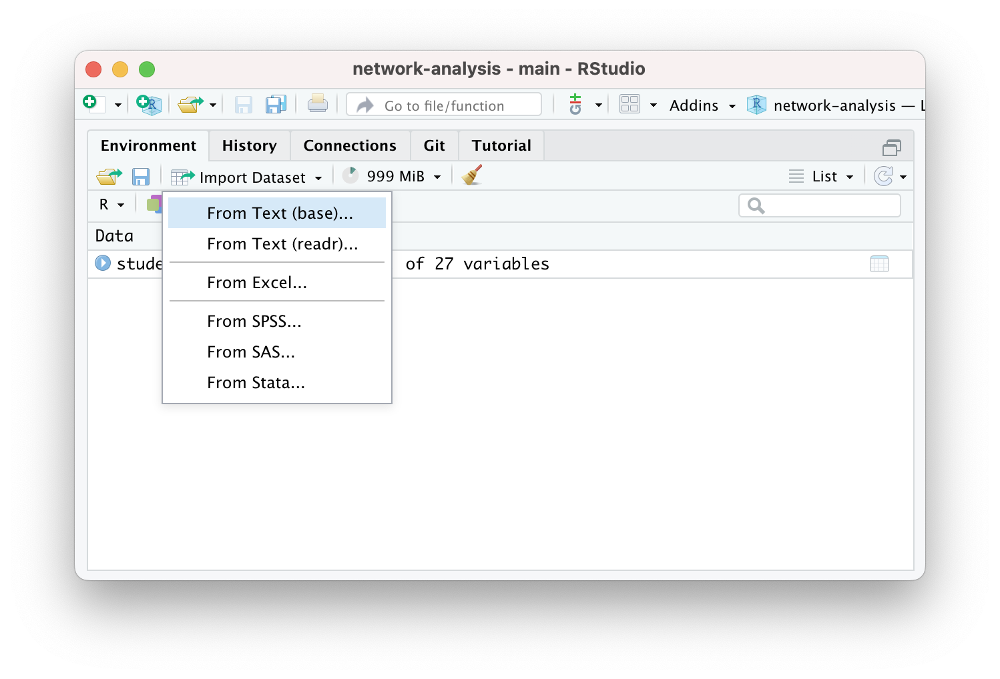

```{r setup, include=FALSE}
knitr::opts_chunk$set(echo = TRUE, message = FALSE, warning = FALSE)
```

## 1. PREPARE

Our first SNA case study is guided by the work of Matthew Pittinsky and
Brian V. Carolan (2008), which employed a social network perspective to
examine teachers' perceptions of student friendships agreed with their
own. Sadly, this excellent study did not include any visual depictions
comparing student and teacher perceived friendship networks, but we are
going to fix that!

Our primary aim for this case study is to gain some hands-on experience
with essential R packages and functions for SNA. We learn how to
preparing network data for analysis and creating a simple network
sociogram to help describe visually what our network "looks like."
Specifically, this case study will cover the following topics pertaining
to each data-intensive workflow process [\@krumm2018]:

1.  **Prepare**: Prior to analysis, we'll look at the context from which
    our data came, formulate some research questions, and get introduced
    the {tidygraph} and {ggraph} packages for analyzing and visualizing
    relational data.

2.  **Wrangle**: In the wrangling section of our case study, we will
    learn some basic techniques for manipulating, cleaning,
    transforming, and merging network data.

3.  **Explore**: With our network data tidied, we learn to calculate
    some key network measures and to illustrate some of these stats
    through network visualization.

4.  **Model**: We conclude our analysis by introducing community
    detection algorithms for identifying groups and revisiting sentiment
    about the common core.

5.  **Communicate**: We develop a polished sociogram to highlight key
    findings.

### 1a. Review the Research

{width="50%"}

Pittinsky, M., & Carolan, B. V. (2008). Behavioral versus cognitive
classroom friendship networks. *Social Psychology of
Education*, *11*(2), 133-147.

#### Abstract

Researchers of social networks commonly distinguish between "behavioral"
and "cognitive" social structure. In a school context, for example, a
teacher's perceptions of student friendship ties, not necessarily actual
friendship relations, may influence teacher behavior. Revisiting early
work in the field of sociometry, this study assesses the level of
agreement between teacher perceptions and student reports of
within-classroom friendship ties. Using data from one middle school
teacher and four classes of students, the study explores new ground by
assessing agreement over time and across classroom social contexts, with
the teacher-perceiver held constant. While the teacher's perceptions and
students' reports were statistically similar, 11--29% of possible ties
did not match. In particular, students reported significantly more
reciprocated friendship ties than the teacher perceived. Interestingly,
the observed level of agreement varied across classes and generally
increased over time. This study further demonstrates that significant
error can be introduced by conflating teacher perceptions and student
reports. Findings reinforce the importance of treating behavioral and
cognitive classroom friendship networks as distinct, and analyzing
social structure data that are carefully aligned with the social process
hypothesized.

#### Research Questions

The central question guiding this investigation was:

> Do student reports agree with teacher perceptions when it comes to
> classroom friendship ties and with what consequences for commonly used
> social network measures?

We will be using this question to guide our own analysis of the
classroom friendships reported by teachers. Specifically, we will use
the first part of this question to guide our analysis and develop two
sociograms to help visually compare similarities and differences between
teacher and student reported classroom friendships.

#### Data Collection

To measure the level of agreement between student and teacher reports of
classroom student friendships, sociometric data were collected from each
student in all four classes and the teacher provided similar reports on
all students. To collect student reports of friendships, students were
given a class roster and asked to describe their relationship with each
student in the class. Choices included best friend, friend, know-like,
know, know-dislike, strongly dislike, and do not know. In the
terminology of network analysis, these sociometric data are "valued"
(degrees of friendship, not just yes or no) and "directed" (friendship
nominations were not presumed to be reciprocal). Data were collected in
the autumn and spring. All "best friend" and "friend" choices are coded
as '1' (friend), while all other choices are coded as '0' (not friend).
The teacher's reports of students' friendships were generated in a
similar manner.

#### Analyses

To assess agreement between perceived friendship by the teacher and
students, QAP (quadratic assignment procedure) correlations for each
class's two matrices (teacher and student generated) were analyzed in
the autumn and spring. A QAP correlation is used to calculate the degree
of association between two sets of relations; it tests whether the
probability of dyad overlap in the teacher matrix is correlated with the
probability of dyad overlap in the student matrix. It does so by running
a large number of simulations. These simulations generate random
matrices with sizes and value distributions based on the original two
matrices being tested. It then computes an average level of correlation
between the matrices that would be expected at random. Similarly, it
calculates the probability that the observed degree of correlation
between two matrices would be as large or as small as that observed
based on the range of correlations generated in the random permutations,
with an associated significance statistic.

#### Key Findings

As reported by @pittinsky2008behavioral in their findings section:

> While the teacher's perceptions and students' reports were
> statistically similar, 11--29% of possible ties did not match. In
> particular, students reported significantly more reciprocated
> friendship ties than the teacher perceived.

#### **👉 Your Turn** **⤵**

Based on what you know about networks and the context so far, what other
research question(s) might ask we ask in this context that a social
network perspective might be able to answer?

In the space below, type a brief response to the following questions:

-   YOUR RESPONSE HERE

### 1c. Load Packages

As highlighted in [Chapter 6 of Data Science in Education Using
R](https://datascienceineducation.com/c06.html) (DSIEUR), one of the
first steps of every workflow should be to set up your "Project" within
RStudio. Recall that:

> A **Project** is the home for all of the files, images, reports, and
> code that are used in any given project

Since we are working from an R project cloned from GitHub, a Project has
already been set up for you as indicated by the `.Rproj` file in your
main directory in the Files pane. Instead, we will focus on getting our
project set up withe the requisite packages we'll need for analysis.

**Packages**, or sometimes called libraries, are shareable collections
of R code that can contain functions, data, and/or documentation and
extend the functionality of R. You can always check to see which
packages have already been installed and loaded into RStudio Cloud by
looking at the the Files, Plots, & Packages Pane in the lower right-hand
corner.

#### tidyverse 📦

{width="30%"}

One package that we'll be using extensively is {tidyverse}. Recall from
earlier tutorials that the {tidyverse} package is actually a [collection
of R packages](https://www.tidyverse.org/packages) designed for reading,
wrangling, and exploring data and which all share an underlying design
philosophy, grammar, and data structures. These shared features are
sometimes "tidy data principles."

Click the green arrow in the right corner of the "code chunk" that
follows to load the {tidyverse} library as well as the {here} package
introduced in previous labs.

```{r load-tidyverse}
library(tidyverse)
```

Don't worry if you saw a number of messages: those probably mean that
the tidyverse loaded just fine. Any conflicts you may have seen mean
that functions in these packages you loaded have the same name as
functions in other packages and R will default to function from the last
loaded package unless

Next, we will introduce two new packages extend the tidyverse suite of
packages and that we will use throughout SNA Learning Labs 1-4.

### New Packages

#### tidygraph 📦

{width="20%"}

The {[tidygraph](https://tidygraph.data-imaginist.com)} package is a
huge package that exports 280 different functions and methods, including
access to almost all of the `dplyr` verbs plus a few more, developed for
use with relational data. While network data itself is not tidy, it can
be envisioned as two tidy tables, one for node data and one for edge
data.

The {tidygraph} package provides a way to switch between the two tables
and uses `dplyr` verbs to manipulate them. Furthermore, it provides
access to a lot of graph algorithms with return values that facilitate
their use in a tidy workflow.

#### ggraph 📦

{width="20%"}

Created by the same developer as {tidygraph},
{[ggraph](https://ggraph.data-imaginist.com/index.html)} -- pronounced
gg-raph or g-giraffe hence the logo -- is an extension of
{[ggplot](https://ggplot2.tidyverse.org)} aimed at supporting relational
data structures such as networks, graphs, and trees. Both packages are
more modern and widely adopted approaches data visualization in R.

While ggraph builds upon the foundation of ggplot and its API, it comes
with its own self-contained set of geoms, facets, etc., as well as
adding the concept of *layouts* to the [grammar of
graphics](https://ggplot2-book.org/introduction.html?q=grammar#what-is-the-grammar-of-graphics),
i.e. the "gg" in ggplot and ggraph.

#### **readxl 📦**

{width="20%"}

The [{readxl}](https://readxl.tidyverse.org/) package makes it easy to
get data out of Excel and into R. Compared to many of the existing
packages (e.g. gdata, xlsx, xlsReadWrite) readxl has no external
dependencies, so it's easy to install and use on all operating systems.
It is designed to work with *tabular* data.

Since one of our data wrangling steps in the next section is importing
network matrices stored in excel files, this package will come in handy.

**R Studio Tip:** Type `?read_excel` into the console and check the
arguments section to examine the different arguments that can be used
with this function.

#### **👉 Your Turn** **⤵**

Use the code chunk below load the {tidygraph}, {ggraph}, and {readxl}
packages:

```{r load-packages}
# YOUR CODE HERE


```

------------------------------------------------------------------------

## 2. WRANGLE

In general, data wrangling involves some combination of cleaning,
reshaping, transforming, and merging data [@wickham2016r]. As
highlighted in @estrellado2020e, wrangling network data can be even more
challenging than other data sources since network data often includes
variables about both individuals and their relationships.

For our data wrangling in lab 1, we're keeping it relatively simple
since working with relational data is a bit of a departure from our
working with rectangular data frames. Our primary goals for Lab 1 is
learning how to:

a.  **Import Data from Excel**. In this section, we learn about the
    `read_xlsx()` function for importing a data stored in a format in a
    unique two common formats for storing network data: matrices and
    nodelists.

b.  **Make a Tidy Graph**. Before we can create our sociogram, we'll
    first need to convert our data frames into special data format, an R
    network `tbl_graph` object, for working with relational data.

### 2a. Import Data

One of our primary goals for this case study to is create network graph
called a sociogram that visually describes what a network "looks like"
from the perspective of both students and their teacher. To do so, we'll
need to import two Excel files originally obtained from the [Social
Network Analysis and Education companion
site](https://studysites.sagepub.com/carolan/study/resources.htm). Both
files contain edges stored as a matrix and are included in the lab-1
data folder of your R Studio project. A description of each file from
the companion website is copied below along with a link to the original
file:

1.  [**99472_ds3.xlsx**](https://studysites.sagepub.com/carolan/study/materials/datasets/99472_ds3.xlsx)This
    adjacency matrix consists of **student-reported** friendship
    relations among 27 students in one class in the fall semester. These
    data are directed and unweighted; a friendship tie is present if the
    student reported that another was either a best friend or friend.

2.  [**99472_ds5.xlsx**](https://studysites.sagepub.com/carolan/study/materials/datasets/99472_ds5.xlsx)This
    adjacency matrix consists of the **teacher-reported** friendship
    relations among 27 students in one class in the fall semester. These
    data are directed and unweighted; a friendship tie is present if the
    teacher reported that students were either a best friend or friend.

Relational data (i.e., information about the relationships among
individuals in a network) are sometimes stored as an [adjacency
matrix](https://en.wikipedia.org/wiki/Adjacency_matrix). Network data
stored as a matrix includes a column and row for each actor in our
network and each cell contains information about the **tie** between
each pair of actors, often referred to as **edges**. In our case, the
tie is a directed meaning that relationships between actors may not
necessarily be reciprocated. For example, student 1 may report student 2
as a friend, but student 2 may or may not report student 1 as friend. If
both student 2 and student 2 indicate each other as friends, then this
tie, or edge, is considered **reciprocal** or **mutal**.

#### Import Student-Reported Friendships

Let's use the `read_excel()` function to import
the `student-reported-friends.xlsx` file, In our function, we'll include
an important "argument" called `col_names =` and set it to `FALSE`. This
tells R that our file does not include column names and is important to
include since our file is a simple matrix with no header or column names
and by default this argument is set to true and would assign the first
row which contains data about student friendships as names for each
column.

Finally, we need to make sure we can reference the matrix we import and
use it later in our analysis. To do so, will save it to our
"Environment" by assigning it to a variable which we will
call `student_friends`.

```{r student-data}
student_friends <- read_excel("data/student-reported-friends.xlsx", 
                              col_names = FALSE)
```

Before importing our teacher reported friendship file, let's quickly
inspect the `student_friends` R object we just imported to see what
we'll be working with.

```{r inspect-students}
student_friends
```

As you can see, we have a 27 x 27
"[tibble](https://tibble.tidyverse.org/)" or data table representing our
student friendships. Unfortunately, this data is stored in such a simple
format, we have no way to easily identify who is friends with who since
our data is missing names or some kind of identifier for students in our
network.

#### Add Names

R has packages for creating random names to help anonymize data, but to
keep things simple, we'll just assign the numbers 1 through 27 as names
for our rows and columns.

```{r assign-names}
rownames(student_friends) <- 1:27

colnames(student_friends) <- 1:27
```

You may have seen a warning
stating: `Setting row names on a tibble is deprecated.` You can ignore
that for now but it's basically telling us these functions are old we we
need to use newer function or our code will some day stop working.

Again, let quickly inspect our `student_friends` data table to see if
this worked:

```{r view-students}
student_friends
```

Much better! Now we can see that student 1 indicated that student 2 is
their friend, and student 2 indicated that student 1 is their friend, so
we can say that this friendship is "reciprocated" or "mutual." As we'll
see in Lab 2, reciprocity is an import network-level measure in SNA.

#### Import Student Attributes

Before importing our teacher-reported student friendships, we have
another important file to import. As noted by @carolan2014 , most social
network analyses include variables that describe the attributes of
actors in a network. These attribute variables can be either categorical
(e.g., sex, race, etc.) or continuous in nature (e.g., test scores,
number of times absent, etc.).

Actor attributes are stored a rectangular array, or data frame, in which
rows represent a social entity (e.g., students, staff, schools, etc.),
columns represent variables, and cells consist of values on those
variables. This file containing a list of actors, or nodes, along with
their attributes is sometimes referred to as a **node list**.

Let's go ahead and read our node list into R and store as a new object
called `student_attributes`:

```{r student-attributes}

student_attributes <- read_excel("data/student-attributes.xlsx")

student_attributes
```

Note that when we imported this time, we left out the
`col_names = FALSE` argument. As mentioned earlier, by default this
argument is set to TRUE and assumes the first row of your data frame
will contain names of the variables. Since this was indeed the case, we
didn't need to include this argument. We could, however, have included
this argument and set it to `TRUE` and our resulting output would still
be the same.

#### **👉 Your Turn** **⤵**

Complete the code chunk below to import the
`teacher-reported-friends.xlsx` file, add row and column names, and
inspect your `teacher_friends` object.

```{r import-teacher}
# YOUR CODE HERE
teacher_friends <- read_excel()

rownames(teacher_friends) <- 

colnames(teacher_friends) <- 

teacher_friends
```

**RStudio Tip:** If you happen to run into issues with data import,
RStudio has a handy "Import Dataset" feature for a point and click
approach to adding data to your environment.



If you want to give this a try, be sure to pay attention to the default
settings and the name it will give your data frame when imported. Also
be sure to include the R code it generates in your R script or markdown
file.


### 2b. Make a Tidy Graph

Before we can begin exploring our data through through network
visualization, we must first restructure our "tibble" into a formal
matrix object recognized by r, and then convert our matrix to a network
class R object required by the {tidygraph} and {ggraph} packages.

#### **Convert to Graph Object**

Our final step before we're able to begin exploring our data is to
convert our matrix to a network object recognized by the {tidygraph} and
{ggraph} packages.

The [`as_tbl_graph()`](https://tidygraph.data-imaginist.com/reference/tbl_graph.html) general
function can easily convert relational data from all common network data
formats such as matrices, `network`, `phylo`, `dendrogram`, `data.tree`,
`graph`, etc. 

Let's run the following code to convert our matrix to directed network
graph and save as a new object called `student_network`. We'll also
include the argument `directed = TRUE` in our `as_tbl_graph()` function
to indicate that our network is directed.

```{r convert-network}
student_network <- as_tbl_graph(student_matrix, 
                                directed = TRUE)
```

Now let's take a quick look at our new `student_network` object:

```{r student-network}
student_network
```

As you can see, our `student_network` object provides a range of
information about out network including network size, type, number of
components, and a preview of the node and edge lists that it created.
The node and edge lists are treated just like a typical data frame and
can now be used with other tidyverse packages and functions to create
new actor-level network variables like degree, reciprocity, and
centrality measures.

#### What is an edge list?

The node list is a pretty typical format for social science research,
we've just given it a different name. But what exactly is an edge list?

> An **edgelist** is way to store relational data, or network ties, and
> commonly used in network analysis. Specifically, the values in the
> first two columns of each row represent a dyad, or tie between two
> nodes in a network.

This format is likely very different than other formats you have worked
with before. An edge-list can also contain other information regarding
the strength, duration, or frequency of the relationship, sometime
called **weight**, in addition to other "edge attributes."

In directed networks like ours, the first column indicates that student
1 reported students 2, 4, and 5 are friends. Since our network is
unweighted, the 1 for "weight" just indicates that a friendship was
present. Our data folder also contains a valued adjacency matrix which
indicates the "strength" of the relationship or friendship, but we'll
stick with the simpler of the two matrices for now.

Let's take a closer look at those edges. The {tidygraph} package has a
useful `activate()` function that we will be using extensively
throughout the SNA learning labs. This function allows us to work with
the nodes and edges in our network object as if they were typical data
frames and apply to them the entire suite of {tidyverse} functions for
wrangling and summarizing data.

For now, let's just use the `activate()` function to single out the
edgelist in our network object, use the `as_tibble()` function to
temporarily convert it to a data frame, and use the `<-` assignment
operator to permanently save it in our environment as `student_edges`.

We'll also use a very powerful `|>` operator called a **pipe**. Pipes
are a powerful tool for combining a sequence of functions or processes.
The original pipe operator, `%>%`, comes from the {**magrittr**} package
but all packages in the tidyverse load `%>%` for you automatically, so
you don't usually load magrittr explicitly.

The pipe has become such a useful and much used operator in R that it is
now baked into R using the new and simpler version of the pipe `|>`
operator demonstrated in the following code chunk:

```{r}
student_edges <- student_network |>
  activate(edges) |>
  as_tibble()

student_edges
```

Great! Now we can see the full list of edges in our network ordered by
student ids.

More importantly, however, is now that we have our edges stored in a
standard format, we can combine our `student_edges` and
`student_attributes` data frames into a single network object that
contains the information from both!!

To do so, we'll use the more standard `tbl_graph()` function from the
{tidygraph}. To do so, we'll use the more standard `tbl_graph()`
function from the {tidygraph}. First, run the following code to take a
look at the help documentation for this function:

```{r function_help, eval=FALSE}
?tbl_graph
```

You probably saw that this particular function takes the following three
arguments, two of which are data frames:

-   **`edges =`** A `data.frame` containing information about the edges
    in the graph. The terminal nodes of each edge must either be encoded
    in a `to` and `from` column, or be in the two first columns.

-   **`nodes =`** a node list that starts with a column of node IDs. Any
    following columns are interpreted as node attributes.

-   **`node_key =`** The name of the column in `nodes` that character
    represented `to` and `from` columns should be matched against.

-   **`directed =`** determines whether or not to create a directed
    graph.

Now let's run the following code to specify our `ties` data frame as the
edges of our network, our `actors` data frame for the vertices of our
network and their attributes, and indicate that this is indeed a
directed network.

```{r create-edgelist}
student_network <- tbl_graph(edges = student_edges, # specifies edges
                             nodes = student_attributes, # specifies nodes
                             directed = TRUE) # specifies directionality

student_network
```

Much better!! Now we can see that in addition to the edges in our
network, our network object now contains information about students'
gender and achievement levels in text and numerical format.

#### **👉 Your Turn** **⤵**

Complete the code chunk below to convert your `teacher_friends` object
first to a matrix and then to a network object that contains information
about both the teacher-reported student friendships and the attributes
of students:

```{r teacher-network}
# YOUR CODE HERE

teacher_network <- as_tbl_graph()

teacher_edges <- teacher_network |>
  activate() |>
  as_tibble()

teacher_network <- tbl_graph(edges = , 
                             nodes = , 
                             directed = )

teacher_network
```

Now answer the questions that following questions:

1.  How many students are in our network?

    -   YOUR RESPONSE HERE

2.  Who reported more friendships, teachers or students? How do you
    know?

    -   YOUR RESPONSE HERE

------------------------------------------------------------------------

## 3. EXPLORE

As noted in in our course readings, exploratory data analysis involves
the processes of describing your data (such as by calculating the means
and standard deviations of numeric variables, or counting the frequency
of categorical variables) and, often, visualizing your data prior to
modeling.

In Section 3 work focus on just visualization, and will use the
{tidygraph} package to create a network sociogram to help visually
describe our network and compare teacher and student reported
friendships. Specifically, in this section we'll learn to make a:

a.  **Simple Sociogram**. We learn about the basic `plot()` and
    `auto_graph()` functions for creating a very quick network plot when
    just a quick visual inspection is needed.

b.  **Sophisticated Sociogram**. We then dive deeper in to the
    `ggraph()` function and learn to plot nodes and edges in our network
    and tweak key elements like the size, shape, and position of nodes
    and edges to better at communicating key findings.

One of the defining characteristics of the social network perspective is
its use of graphic imagery to represent actors and their relations with
one another. To emphasize this point, @carolan2014 reported that:

> The visualization of social networks has been a core practice since
> its foundation more than 100 years ago and remains a hallmark of
> contemporary social network analysis. 

Network visualization can be used for a variety of purposes, ranging
from highlighting key actors to even serving as works of art.

This excellent figure from Katya Ognyanova's also excellent tutorial on
[Static and Dynamic Network Visualization with
R](https://kateto.net/network-visualization/) helps illustrate the
variety of goals a good network visualization can accomplish:

{width="80%"}

### 3a. Simple Sociograms

These visual representations of the actors and their relations, i.e. the
network, are called a **sociogram**. Actors who are most central to the
network, such as those with higher node degrees, or those with more
friends in our case study, are usually placed in the center of the
sociogram and their ties are placed near them.

The `plot()` function from R's built in {graphics} package can be used
to make a wide range of graphs, including sociograms, but as you'll see
it's a bit lacking and is limited limited in the level of customization
allowed.

In the code chunk below, use the `plot()` function with your
`students_network` object to see what the basic plot function produces:

```{r plot-network}
plot(student_network)
```

Not super great. In fact, it's visualizations like these that give
sociograms the unflattering nickname of "hair ball" plots!

If this had been a smaller network it might have been a little more
useful but one important insight is that we have already identified an
"isolate" in our network, i.e., student 19 who neither named others as a
friend or was named by others as a friend.

Fortunately, the {ggraph} package includes a plethora of plotting
parameters for graph
[layouts](https://ggraph.data-imaginist.com/articles/Layouts.html),
[edges](https://ggraph.data-imaginist.com/articles/Edges.html) and
[nodes](https://ggraph.data-imaginist.com/articles/Nodes.html) to
improve the visual design of network graphs.

Let's first take a quick look the `auto_graph()` function for making
quick and simple sociograms similar to the R base plotting function
above:

```{r auto-graph}
autograph(student_network)
```

A little better, but also lacking in many important ways. Like the
`plot()` function, it does allow some small degree of customization, but
is still rather limited and best use for very quick sociograms to get a
quick feel for the data.

Run the following code chunk to see some additional arguments you can
add to the `autograph()` function:

```{r student-sociogram}
autograph(student_network,
          node_label = id,
          node_colour = gender)
```

#### **👉 Your Turn** **⤵**

Use the code chunk below to try out these simple sociogram functions on
your `teacher_network` object you created above:

```{r teacher-sociogram}
# YOUR CODE HERE


```

Not exactly great graphs, but they already provided some insight into
our research questions. Specifically, we can see visually that teacher
and student reported peer networks are very different!

### 3b. Sophisticated Sociograms

One thing to keep in mind when building a network viz with {ggraph}, is
that just like it's `ggplot()` counterpart introduced in Foundation
Labs, the `ggraph()` function is the first function required to build a
sociogram. This function takes care of setting up the plot object as
well as creating the layout for the sociogram based on the network
object and the layout specification provided.

Let's first pass our `student_network` object to `ggraph()` and see what
happens.

```{r ggraph}
ggraph(student_network)
```

Wow, that was unimpressive. But don't worry, just like the `ggplot()`
function, `ggraph()` doesn't produce much on it's own. All that the
`ggraph()` function does is set up the network object based on our
`student_network`, and creates a layout for our sociogram, in this case
using the default "stress" layout as indicated by the output.

#### Add Nodes

Very similar to how `ggplot()` uses the `+` operator to "layer"
functions together to progressively build more sophisticated graphs,
`ggraph()` uses the `+` operator progressively build a sociogram.

To add our nodes, we'll added the `geom_node_point()` function. Again,
just like with {ggplot2}, the "geom" in the `geom_non_point()` functions
stands for "Geometric elements", or geoms for short, and represents what
you actually see in the plot.

#### **👉 Your Turn** **⤵**

Now "add" the `geom_node_point()` function to our code using the `+`
operator:

```{r add-nodes}
# YOUR CODE HERE
ggraph(student_network) 
```

Well, at least we have our nodes now!

#### Add Layout

One of the major advances in visualization since the first hand-drawn
sociograms developed by Jacob Moreno (1934) to represent relations among
children in school is the use of software and algorithms to
automatically layout networks on a grid.

There are may different [layout
methods](https://en.wikipedia.org/wiki/Graph_drawing#Layout_methods),
but we'll start with the Fruchterman-Reingold (FR) layout, which is one
of the most widely used layout algorithms for network visualization.
These types of force-directed algorithms generally work well with large
networks and try to layout graphs in "an aesthetically-pleasing way" by
making edges roughly equal in length and minimizing overlap.

Let's go ahead and include the layout argument, which in addition to
including its own unique layouts, can incorporate layouts form {igraph}
package like `fr` for the Fruchterman-Reingold (FR) layout:

```{r add-layout}
ggraph(student_network, layout = "fr") +
  geom_node_point()
```

That's not much better so let's stick with the "stress" layout for now.
Feel free to try out some other [ggraph layout
methods](https://ggraph.data-imaginist.com/articles/Layouts.html) if you
like, however. There are also

#### Tweak Nodes

Also like {ggplot2}, geoms can include aesthetics, or aes for short,
such as `alpha` for transparency, as well as `color`, `shape` and
`size`.

Let's now add some "aesthetics" to our points by including the `aes()`
function and arguments such as `size =` and `color =`. We'll use our
`gender` variable for color and set the size of the node using
`local_size()` function, which will base the size of each node on the
number of friends each student nominated.

```{r add-color}
ggraph(student_network, layout = "stress") + 
geom_node_point(aes(color = gender,
                    size = local_size()))
```

We can easily see that the number of friends ranges from 5 to 20, with
the exception of one "isolated" student we identified earlier who is not
connected to any other students in the network, and therefore is smaller
in size on the graph.

Let's fix that by adding another layer with some node text and labels.
Since node labels are a geometric element, we can apply aesthetics to
them as well, like color and size. Let's also include the `repel =`
argument that when set to `TRUE` will avoid overlapping text.

```{r add-labels}
ggraph(student_network, layout = "stress") + 
  geom_node_point(aes(size = local_size(),
                      color = gender)) +
  geom_node_text(aes(label = id,
                     size = local_size()),
                 repel = TRUE)
```

#### Add Edges

Now, let's literally connect the dots and add some
[edges](https://ggraph.data-imaginist.com/articles/Edges.html) using the
`geom_edge_link()` function.

```{r}
ggraph(student_network, layout = "stress") + 
  geom_node_point(aes(size = local_size(),
                      color = gender)) +
  geom_node_text(aes(label = id),
                 repel=TRUE) +
  geom_edge_link()
```

Ack! Without some adjustment, the edges make it really difficult to see
the nodes. Fortunately, you can also adjust the edges just like we did
to the nodes above: Let's now include the following arguments:

-   `arrow =` to include some arrows 1mm in length

-   `end_cap =` and `start_cap =` to keep arrows from overlapping the
    nodes, and to

-   `alpha = .2` set the transparency of our edges so our edges fade
    more into the background and help keep the focus on our nodes:

```{r tweak-edges}
ggraph(student_network, layout = "stress") + 
  geom_node_point(aes(size = local_size(),
                      color = gender)) +
  geom_node_text(aes(label = id),
                 repel=TRUE) +
  geom_edge_link(arrow = arrow(length = unit(1, 'mm')), 
                 end_cap = circle(3, 'mm'),
                 start_cap = circle(3, 'mm'),
                 alpha = .2)
```

Note: There are many [different ways we can represent edges in a
network](https://www.data-imaginist.com/2017/ggraph-introduction-edges/)
beyond simple links. Try replacing `geom_edge_link` with `geom_edge_arc`
and see what happens!

#### Add a Theme

Finally, let's add a **theme,** which controls the finer points of
display, like the font size and background color. The `theme_graph()`
function add a theme specially tuned for graph visualizations. This
function removes redundant elements in order to put focus on the data
and if you type `?theme_graph` in the console you will get a sense of
the level of fine tuning you can do if desired.

Let's add `theme_graph()` to our sociogram, remove the legends since
they are not especially useful, and call it good for now:

```{r add-theme}
ggraph(student_network, layout = "stress") + 
  geom_edge_link(arrow = arrow(length = unit(1, 'mm')), 
                 end_cap = circle(3, 'mm'),
                 start_cap = circle(3, 'mm'),
                 alpha = .1) +
  geom_node_point(aes(size = local_size(),
                      color = gender)) +
  geom_node_text(aes(label = id),
                 repel=TRUE) +
  theme_graph()
```

Much better! Notice also how we shifted the `geom_node_point()` layer of
our graph to after the `geom_edge_link()` so the parts of nodes would
not be hidden under the edges.

**Note:** If you're having difficulty seeing the sociogram in the small
R Markdown code chunk, you can copy and paste the code in the console
and it will show in the Viewer pan and then you can enlarge and even
save as an image file.

#### **👉 Your Turn** **⤵**

Now that you have a sense of how the {ggraph} package works to build
network graphs, use the code chunk below and try building sophisticated
sociogram for the `teacher_network` object that you created above.

There are no right or wrong answers, just have some fun trying out
different options for graph
[layouts](https://ggraph.data-imaginist.com/articles/Layouts.html),
[edges](https://ggraph.data-imaginist.com/articles/Edges.html) and
[nodes](https://ggraph.data-imaginist.com/articles/Nodes.html) and see
if you can build something that is visually pleasing to you.

```{r your-sociogram}
# YOUR CODE HERE


```

Congrats, you made it to the end of the EXPLORE section and created your
first sociogram in R!

------------------------------------------------------------------------

## 4. MODEL

As highlighted in [Chapter 3 of Data Science in Education Using
R](https://datascienceineducation.com/c03.html), the **Model** step of
the data science process entails "using statistical models, from simple
to complex, to understand trends and patterns in the data." We will not
explore the use of models for SNA until Lab 4, but recall from the
PREPARE section that to assess agreement between perceived friendships
by the teacher and students, [@pittinsky2008behavioral] note that:

> **The QAP (quadratic assignment procedure)** [is] used to calculate
> the degree of association between two sets of relations and tests
> whether the probability of dyad overlap in the teacher matrix is
> correlated with the probability of dyad overlap in the student matrix.
> It does so by running a large number of simulations. These simulations
> generate random matrices with sizes and value distributions based on
> the original two matrices being tested.

We will learn more about the QAP and other models for statistical
inference when working with relational data in Learning Lab 4.

------------------------------------------------------------------------

## 5. COMMUNICATE

The final step in the workflow/process is sharing the results of your
analysis with wider audience. For now, we will wrap up this case study
by converting our work into a webpage that can be used to communicate
your learning and demonstrate some of your new R skills. To do so, you
will need to "knit" your document by clicking the
{width="10%"} button in the menu bar at that the top of
this file. This will do two things; it will:

1.  check through all your code for any errors; and,

2.  create a file in your directory that you can use to share you work
    through [Posit
    Cloud](https://posit.cloud/learn/guide#publish-from-cloud) (see
    screenshot example below to publish), [RPubs](#0) , [GitHub
    Pages](#0), [Quarto Pub](#0), or [other methods](#0).

### Knit and Publish

Complete the following steps to knit and publish your work:

1.  First, change the name of the `author:` in the [YAML
    header](https://bookdown.org/yihui/rmarkdown-cookbook/rmarkdown-anatomy.html#yaml-metadata)
    at the very top of this document to your name. The YAML header
    controls the style and feel for knitted document but doesn't
    actually display in the final output.

2.  Next, click the knit button in the toolbar above to "knit" your R
    Markdown document to a
    [HTML](https://bookdown.org/yihui/rmarkdown/html-document.html) file
    that will be saved in your R Project folder. You should see a
    formatted webpage appear in your Viewer tab in the lower right pan
    or in a new browser window. Let's us know if you run into any issues
    with knitting.

3.  Finally, publish your webpage on Posit Cloud by clicking the
    "Publish" button located in the Viewer Pane after you knit your
    document. See screenshot below.

{width="80%"}

Congratulations, you've completed your first case study! You're now
ready to dig into the essential readings and try out your first SNA
LASER Badge!

### References
