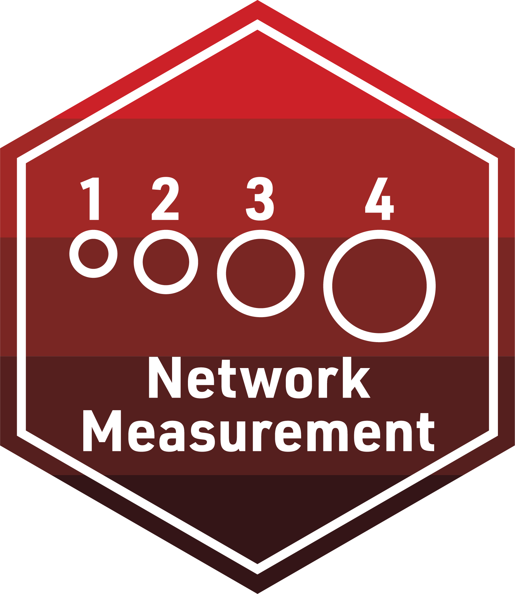

```{r setup, include=FALSE}
knitr::opts_chunk$set(echo = TRUE)
```

{width="40%"}

The final activity for each learning lab provides space to work with data and to reflect on how the concepts and techniques introduced in each lab might apply to your own research.

To earn a badge for each lab, you are required to respond to a set of prompts for two parts: 

-   In Part I, you will reflect on your understanding of key concepts addressed in the case study and essential readings and begin to think about potential next steps for your own study.

-   In Part II, you will create a simple data product in R that demonstrates your ability to apply a data analysis technique introduced in this learning lab.

### Part I: Reflect and Plan

Use your institutional library, [Google Scholar](https://scholar.google.com/), or search engine of your choice to locate a research article, presentation, or resource that applies social network analysis to an educational context or topic of interest. More specifically, **locate a network study that makes use of network-level structural measures to describe mathematically the network being studied.** You are also welcome to select one of the research papers listed in the [essential readings](https://github.com/laser-institute/essential-readings/tree/main/sna-labs) that may have piqued your interest.

1.  Provide an APA citation for your selected study.

    -   

2.  Were the data collected on the complete, ego, or partial network? Describe the sources of these network data.

    -   

3.  What relations were measured and what instruments were used to measure them?

    -   

Think about a network that you may be interested in studying, and answer the following questions:

4.  Would your study employ a positional, relational, or event-based approach to specify the network's boundary?

    -   

5.  What data would you want to collect for this study and how might you go about doing it?

    -   

6.  What relations would you measure and what individual attribute information might you collect?

    -   

7.  How might you approach collecting this data for your study? 

    -   

### Part II: Data Product

Using the data from our case study or one of the data sets provided in the data folder, **your goal for this lab is to create a polished sociogram and write a brief narrative including some network measures to help describe your network.** For example, you may be interested in comparing size, density and level of reciprocity of two networks.

**Alternatively, you may use your own data set to create a sociogram and calculate network-level measures to describe it.** 

I highly recommend creating a new R script in your lab-2 folder to complete this task. When your code is ready to share, use the code chunk below to share the final code for your model and answer the questions that follow.

```{r, my-data-product}
# YOUR FINAL CODE HERE


```

#### Narrative

-   WRITE YOUR DESCRIPTION OF THE NETWORK HERE

To receive credit for this assignment and earn your first SNA LASER Badge, you will first need to knit and publish this page to Posit Cloud. Next, share the link to published webpage under one of the **Badge Artifact** columns on the 2023 LASER Scholar Information and Documents spreadsheet: <https://go.ncsu.edu/laser-sheet>. Once your instructor has checked your link, you will be provided a physical version of the badge pictured at the top of this document!
