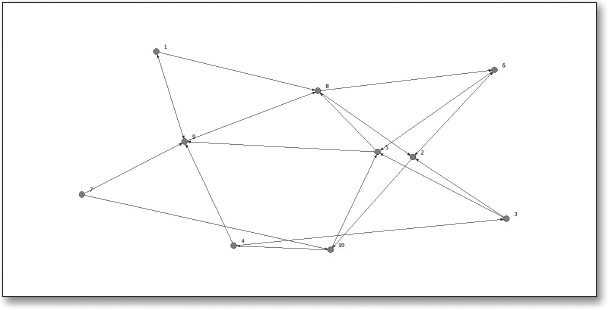

```{r setup, include=FALSE}
knitr::opts_chunk$set(echo = TRUE)
```

## Overview

Our primary goal in this unit is to examine common approaches to data
management and measurement in network analysis. The required and
self-selected readings provide an introduction the collection and
management of relational data, as well as how we can begin to describe
what a complete network looks like, not just visually, but
mathematically. A secondary goal of readings and discussion is to help
you start generating ideas for independent application of network
analysis. As part of our readings, for example, you'll learn how to
specify a network "boundary" for your study based on different
approaches.

## Readings

For Unit 2, you will read chapters 3-5 from [Social Network Analysis and
Education](https://catalog.lib.ncsu.edu/catalog/NCSU2803782)
[@carolan2014] and locate one additional research article, presentation,
or informal study to help address our discussion questions for the week.

### SNA and Education Part II: Methods and Measures

The following readings for this unit focus on issues related to the
collection and measurement of these network variables, including issues
related to boundary specification, sampling, storage, and methodologies.
In addition, the readings introduce important concepts and measures used
to describe static properties of social networks. The conceptual tools
and precise measures help us move beyond basic visualization of
networks, to analysis of networks quantitatively.

1.  [Chapter
    3](https://methods.sagepub.com/book/social-network-analysis-and-education/n3.xml):
    [Basic
    Concepts](https://methods.sagepub.com/book/social-network-analysis-and-education/n3.xml)

2.  [Chapter 4: Collecting and Managing Network
    Data](https://methods-sagepub-com.prox.lib.ncsu.edu/book/social-network-analysis-and-education/n4.xml)

3.  [Chapter 5: Structural Measures for Complete
    Networks](https://methods-sagepub-com.prox.lib.ncsu.edu/book/social-network-analysis-and-education/n5.xml)

### Self-Selected Study

Use the [NCSU Library](https://www.lib.ncsu.edu/#articles), [Google
Scholar](https://scholar.google.com/) or search engine to locate a
research or practitioner-focused article, presentation, or resource that
demonstrates the application of social network analysis to study a
context or topic of interest. You are also welcome to select one of the
research papers listed in
the [syllabus](https://sbkellogg.github.io/eci-589/) or in our [course
text](https://catalog.lib.ncsu.edu/catalog/NCSU2803782) that may have
peaked your interest. Your selection should address one or more of the
discussion topics/questions (see below) and you're welcome to identify
SNA resources outside of the field of education.

## Discussion

In lieu of the peer interaction and discussion of course materials that
normally take place "in-class", you'll be asked to log in this
week and engage with other members of our learning community through
this discussion forum. **With the exception of the Self-Selected Study
questions, you are not required to address every guiding question**,
particularly if you feel others in the class have thoroughly addressed
the topic or questions. Our aim for these discussions is to collectively
build our understanding of these readings through back-and-forth
dialogue and avoid a "collective monologue" in which we see 20
variations of effectively the same post.

To create a new post in response to one or more of the guiding questions
listed below, click "Add a new discussion topic" located below the forum
overview text and add a descriptive title for the subject line. In the
message box, includes the question(s) your post is addressing, as well
as your response to the selected questions. Remember, you are not
required to address every guiding question with the exception of the
Self-Selected Study questions for which you must create one new
discussion topic and respond to the discussion prompt and required
questions.

### Guiding Questions

To help guide our discussions, we will collectively address a set of
guiding questions provided below. You are also welcome to add your own
topics or questions for the class to discuss.

#### Chapter 3: Basic Concepts

Refer to the graph below to answer the following questions:

1.  Is this graph directed or undirected? Are the lines arcs or edges?
    Given your responses to these questions, what type of relation might
    this graph represent?

2.  Based on what you see in this graph, is this relation valued or
    binary?

3.  What attribute data might you want to incorporate into analysis?

Bonus Questions:

Create a matrix that represents the relational data evident in the graph
and answer the following questions:

1.  How many actors are in this matrix?

2.  How many rows and columns are in this matrix?

3.  What type of data are in the cells of this matrix?

4.  Is this matrix symmetric? Explain the values on the diagonal of the
    matrix.



#### Chapter 4: Basic Concepts (Required)

For your self-selected study, provide an APA citation and abstract, then
briefly answer the following questions:

1.  Does the study employs a positional, relational, or event-based
    approach to specify the network's boundary.

2.  Were the data collected on the complete, ego, or partial network?
    Describe the sources of these network data.

3.  What relations were measured and what instruments were used to
    measure them? Evaluate the quality of these relational data in terms
    of validity, reliability, error, and patterns of missingness.

#### Chapter 5: Structural Measures for Complete Networks

Assume you have complete network-level data on school leaders in a large
urban district that is transitioning to a new teacher-evaluation system.
You have relational data on the frequency with which ego discusses this
new system with each alter (0 = never, 1 = sometimes, 2 = regularly, and
3 = frequently) and whether ego turns to alter for advice regarding
general professional matters (1 = yes, 0 = no).

1.  Which structural properties of the complete network might be of
    interest to you? Please explain why these properties might be of
    interest.

2.  Given the same network described above, what would high
    centralization scores on both relations indicate about this
    network's ability to successfully transition to a new evaluation
    system?

3.  How might your response to #2 differ if you knew that the networks
    also had high density scores? Given this new information, what would
    you predict about the transition to a new evaluation system?

## Assessment

Grading for this assignment is fairly lenient, provided that it's clear
from your posts that you've done the required reading. Readings and
discussion for each unit are worth 6 points and judged based on quantity
and quality of your posts.

In term of **quantity** (3 points), you'll be expected to create at
least 4 posts. One post should answer each of the questions for your
self-selected study and three posts and/or replies that help us
collectively address the questions for the required readings. So others
will have an opportunity to read and respond to your posts, your posts
should be spread out over the course of the week and across at least two
different days, preferably not the last two days.

In terms of **quality** (3 points), your posts over the next week should
provide new or insightful contributions to that question or topic.
There is no requisite for the length of each posting, in fact short
conversational exchanges (1-3 paragraphs) are highly encouraged. I
strongly recommend taking a look at Table 1 of [the productive online
discussion
model](https://moodle-courses2122.wolfware.ncsu.edu/pluginfile.php/287931/mod_forum/post/6203/Gao%2C%20Wang%2C%20Sun%20-%202009%20-%20A%20new%20model%20of%20productive%20online%20discussion%20and%20its%20implications%20for%20research%20and%20instruction.pdf) [@gao2009]
for ways to contribute to the conversation. 

At minimum, your collective posts should also help us interpret or
elaborate on discussion topics, questions, or ideas others have shared
by "making connection to the learning materials" and should reference at
some point each of the required chapters and your self-selected reading
or resource.

## References
