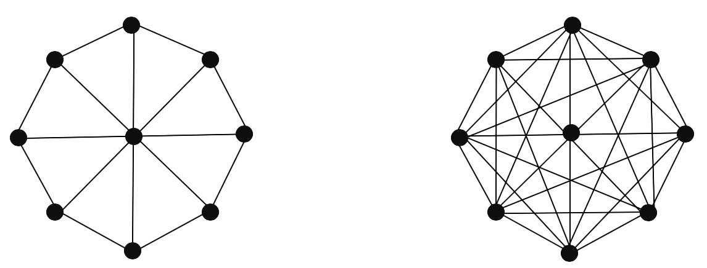

class: clear, title-slide, inverse, center, top, middle

```{r setup, include=FALSE}
knitr::opts_chunk$set(echo = FALSE)
```

```{r, echo=FALSE}
# then load all the relevant packages
pacman::p_load(pacman, knitr)
```

```{r xaringan-panelset, echo=FALSE}
xaringanExtra::use_panelset()
```

```{r xaringanExtra-clipboard, echo=FALSE}
# these allow any code snippets to be copied to the clipboard so they 
# can be pasted easily
htmltools::tagList(
  xaringanExtra::use_clipboard(
    button_text = "<i class=\"fa fa-clipboard\"></i>",
    success_text = "<i class=\"fa fa-check\" style=\"color: #90BE6D\"></i>",
  ),
  rmarkdown::html_dependency_font_awesome()
)
```
```{r xaringan-extras, echo=FALSE}
xaringanExtra::use_tile_view()

```

# `r rmarkdown::metadata$title`
----
### `r rmarkdown::metadata$author`
### `r format(Sys.time(), "%B %d, %Y")`

---
# Agenda

.pull-left[
## Conceptual Overview
Data Management
- Collection
- Management  
- Quality  
]

.pull-right[
## R Code-Along
Network Measurement 
- Density
- Centrality 
- Reciprocity

]


---
# Data Collection


---
# Data Management


---
# Data Quality

.footnote[
Krumm, A. et al. (2018). [Learning analytics goes to school.](https://www.taylorfrancis.com/books/mono/10.4324/9781315650722/learning-analytics-goes-school-andrew-krumm-barbara-means-marie-bienkowski).
]
---
class: clear, inverse, middle, center

# RStudio Code-Along


Network Measures

---
# Literature Review

.panelset[

.panel[.panel-name[Context]

.pull-left[

This longitudinal case study **examines reform-related knowledge, advice, and innovation network structures** among administrators in a districcde fg
t sanction for under-performance and engaging a districtwide reform.
]

.pull-right[

.center[]
]

]

.panel[.panel-name[Questions]

This study involves quantifying and graphically displaying the ties and overall structure of informal networks to answer the following research questions: 

1. In what ways have reform-related social networks between district and site leaders evolved over a 2-year period? 
2. How do district and school leaders perceive the evolution of the social networks and its effect on the exchange of reform-related resources within the district?
]

.panel[.panel-name[Data]
To answer RQ1, Daly and Finnigan administered **online survey consisting of network relations and demographic questions** asking participants to:
- select the administrators in the La Estasis network that you go to for knowledge
- to assess their relationships on a 5-point interaction scale ranging from 1 (no interaction) to 5 (1 to 2 times a week).
- 

]

.panel[.panel-name[Key Findings]

Findings indicate that over time, the networks **increased the number of superficial interactions**, but more frequent exchanges remained unchanged, resulting in a centralized network structure.
]


]


.footnote[
Daly, A. et al. (2011). The ebb and flow of social network ties between district leaders.
]

---
# Load Packages

.panelset[

.panel[.panel-name[Load Libraries]

Let's start by loading the following packages introduced in previous units:          

```{r load-libraries, message=TRUE, echo=TRUE, message=FALSE}
library(readxl)
library(tidyverse)
library(tidygraph)
library(ggraph)
```


]

.panel[.panel-name[igraph 📦]

The {igraph}  package and its collection of network analysis tools provide:

1. pain-free implementation of graph algorithms, 
1. 
1. fast handling of large graphs, with millions of vertices and edges, and

Both {tidygraph} and {ggraph} used in the previous unit and this unit depend heavily on the {igraph} package. 

]


.panel[.panel-name[Your Turn]

Load the {igraph} package.

```{r, echo=FALSE, message=FALSE}
library(igraph)
```

```{r load-igraph, echo=TRUE}
# YOUR CODE HERE


```

]

]

---

# Import Data   

.panelset[

.panel[.panel-name[Import Data]

Let's import two Excel files from the Social Network Analysis and Education companion site. year_1_collaboration.xlsx 

```{r import-data, echo=TRUE, message=FALSE}
year_1_collaboration <- read_excel("data/year_1_collaboration.xlsx", 
                                   col_names = FALSE)
```


]

.panel[.panel-name[Inspect Data]

In the corresponding line of your R script, take a look at the data file we just imported:

```{r inspect-data, echo=TRUE}
# ADD CODE BELOW
#
#

```


]

.panel[.panel-name[Discuss]

Think about the questions below and be prepared to share your response:              

1. What type of data structure is used to store this network data? 
1. What do you think the rows and columns represent? what about the values in each cell?  
1. 

]

.panel[.panel-name[Answer]

- This adjacency matrix reports on **"collaboration" ties among 43 school leaders** in year 1 of a three-year study. 

- This is **a directed valued (weighted) network** measured on five-point scale ranging from 0 to 4, with higher values indicating more frequent collaborations (1–2 times/week).
]
]

---
# Wrangle Data  

.panelset[

.panel[.panel-name[Convert Matrix]

Before we can begin analyzing our network data in R, we need to convert to a network class R object. Run the following code in your R script:

```{r wrangle-data, echo=TRUE, message=FALSE, warning=FALSE}

year_1_matrix <- as.matrix(year_1_collaboration)

rownames(year_1_matrix) <- 1:43

colnames(year_1_matrix) <- 1:43


year_1_network <- as_tbl_graph(year_1_matrix, directed = TRUE)

```


]

.panel[.panel-name[View Network]

In the corresponding line of your R script, type the name of network object we just created and run the code:

```{r view-netwok, echo=TRUE}
# ADD CODE BELOW
#
#

```


]

.panel[.panel-name[Discuss]

Think about the questions below and be prepared to share your response:              

1. What size of the Year 1 collaborationnetwork?
1. What else do you notice about this network?
1. What questions do have about this network?
]

.panel[.panel-name[Extra]

- This adjacency matrix reports on **"collaboration" ties among 43 school leaders** in year 1 of a three-year study. 

- This is **a directed valued (weighted) network** measured on five-point scale ranging from 0 to 4, with higher values indicating more frequent collaborations (1–2 times/week).
]
]


---

# Network Density 

.panelset[

.panel[.panel-name[Definition]

.pull-left[ In its simplest form,  network density is **the ratio of existing ties in a network to all possible ties** that could potentially exist, regardless of whether they do.
]

.pull-right[ .center[

Which of these two networks has a higher density?
]
 
]

]

.panel[.panel-name[Significance]
In education, dense networks have been associated with:   
- healthy learning communities   
- other
- other

For better or worse, **dense networks reinforce prevailing norms** and behaviors and insulate one from outside influences (Carolan, 2011). 

]

.panel[.panel-name[Implementation]
The {igraph} package has a simple `edge_density()` function for calculating network density. Let's apply to our `year_1_network`:

```{r density, echo=TRUE}
edge_density(year_1_network)
```

How would you interpret this measure?
]

.panel[.panel-name[Discuss]

.pull-left[We know there 82 edges in the Year 1 network (pictured right), but **how many possible edges** could there be?   

**Hint**: The number of all possible edges in a directed network is V(V-1) where V is the # of vertices.

<!-- How many possible edges if this were an undirect network? -->
] 

.pull-right[
```{r examine-density, strip.white=TRUE, echo=FALSE}
autograph(year_1_network) +
  theme_graph()
```
]
]
]


---

# Network Centralization 

.panelset[

.panel[.panel-name[Definition]

.pull-left[A key structural property of complete networks is the concept of centralization, or **the extent to which relations are focused on one or a small set of actors**. 
]

.pull-right[ .center[

Which of these two networks is more centralized?
]
 
]

]

.panel[.panel-name[Significance]
In education, dense networks have been associated with:   
- healthy learning communities   
- other
- other

For better or worse, **dense networks reinforce prevailing norms** and behaviors and insulate one from outside influences (Carolan, 2011). 

]

.panel[.panel-name[Implementation]

.pull-left[
The {igraph} package has a simple `edge_density()` function for calculating network density. 

Let's apply to our `year_1_network`:]

.pull-right[
```{r centrality, echo=TRUE}
centr_degree(year_1_network, mode = "all")
```

How would you interpret this measure?
]
]

.panel[.panel-name[Discuss]

.pull-left[We know there 82 edges in the Year 1 network (pictured right), but **how many possible edges** could there be?   

**Hint**: The number of all possible edges in a directed network is V(V-1) where V is the # of vertices.

<!-- How many possible edges if this were an undirect network? -->
] 

.pull-right[
```{r examine-centrality, strip.white=TRUE, echo=FALSE}
autograph(year_1_network) +
  theme_graph()
```
]
]
]

---

# Network Reciprocity 

.panelset[

.panel[.panel-name[Definition]

.pull-left[A key structural property of complete networks is the concept of centralization, or **the extent to which relations are focused on one or a small set of actors**

]

.pull-right[ .center[

Which of these two networks is more centralized?
]
 
]

]

.panel[.panel-name[Significance]
Reciprocity is an important measure because it reveals the direction through which resources in networks flow and whether or not it flows in both directions. 

In education, reciprocity has been associated with:   
- healthy learning communities   
- other
- other

]

.panel[.panel-name[Implementation]

.pull-left[
At the network-level, reciprocity is a measure of the likelihood of vertices in a directed network to be mutually linked. The {igraph} package has a simple `reciprocity()` function for calculating network density. 

Let's apply to our `year_1_network`:]

.pull-right[
```{r reciprocity, echo=TRUE}
reciprocity(year_1_network)
```

How would you interpret this measure? What does it indicate abotu our network? 
]
]

.panel[.panel-name[Discuss]

.pull-left[We know there 82 edges in the Year 1 network (pictured right), but **how many possible edges** could there be?   

**Hint**: The number of all possible edges in a directed network is V(V-1) where V is the # of vertices.

<!-- How many possible edges if this were an undirect network? -->
] 

.pull-right[
```{r examine-reciprocity, strip.white=TRUE, echo=FALSE}
autograph(year_1_network) +
  theme_graph()
```
]
]
]

---


class: clear, wolfhead

.quote[In its simplest form,  network density is **the proportion of existing ties in network to all possible ties** that could potentially exist, regardless of whether they do.]
.author[~ Network Density]


---
# What's Next

.pull-left[
## Readings & Discussion

- Collection
- Management  
- Quality  
]

.pull-right[
## Case Study

- Density
- Centrality 
- Reciprocity

]


---
class: clear, center

## .font130[.center[**Thank you!**]]
<br/>
.center[<br/>**Dr. Shaun Kellogg**<br/><mailto:sbkellog@ncsu.edu>]
