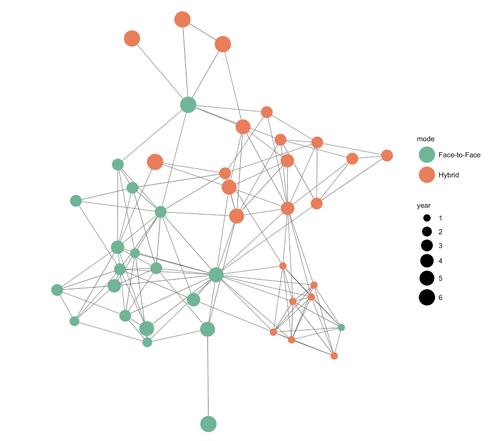

class: clear, title-slide, inverse, center, top, middle

# `r rmarkdown::metadata$title`
## `r rmarkdown::metadata$subtitle`
### `r rmarkdown::metadata$author`
###  2021/08/11 (updated: `r Sys.Date()`)
---

# Objectives

- Gain an understanding of two key network processes, _influence_ and _selection_
- Understand examples of research questions and research studies that focus on selection processes
- View some code for estimating selection models
- Discuss some ideas for social network studies that involve selection effects
- Identify resources for learning more

Slides: https://laser-institute.github.io/laser-institute-selection-processes-workshop

---

# Social networks are commonplace!

We are often impacted by our networks

- Josh’s friend Ryan Estrellado sharing about Ted Lasso on Slack
- Seeing how colleagues negotiate speaking up in a department meeting
- TikTok dance competitions

---

# Discussion of social network analysis interests

```{r, echo = FALSE, out.width="35%", fig.align = "center"}
knitr::include_graphics("https://image.freepik.com/free-vector/illustration-with-young-people-talking_52683-29824.jpg")
```

In what are you interested relating to **social networks/social network analysis**?


---

# Many analyses assume this structure

```{r, echo = FALSE, out.width="50%", fig.align='center'}
knitr::include_graphics("img/sna-pres_3.png")
```

---

# HLM/Multi-level modeling allow for this

```{r, echo = FALSE, out.width="60%", fig.align='center'}
knitr::include_graphics("img/sna-pres_2.png")
```

---

# Social network analyses takes a different perspective

```{r, echo = FALSE, out.width="50%", fig.align='center'}
knitr::include_graphics("img/sna-pres_1.png")
```

---

# Put another way, we can focus deeply on these

```{r, echo = FALSE, out.width="60%", fig.align='center'}
knitr::include_graphics("https://ideas.ted.com/wp-content/uploads/sites/3/2018/06/featured_art_istock1.jpg?resize=1536,922")
```

---

# The Big Picture

Human social networks involve _actors_ and _ties_

Ties represent either resource flows or relationships

So, what's different? 

Ties (in the context of actors) --- and _what explains them_ and _what they produce_

---

# The social network perspective 

More specifically, one foundational way of viewing social networks is in terms of two _processes_

Two key processes are _selection_ and _influence_ ([Frank, 1998](https://journals.sagepub.com/doi/abs/10.3102/0091732x023001171))

We can think of processes as what drive the creation and change of a network

***N.b.*: This is very different from focusing on the attributes of whole networks**

---

# Influence

- Influence has long been a key construct in network analysis (Sweet, 2018). 
- For instance, sociologists developing the social influence approach used statistical models to understand how social capital (i.e., resources inherent to and available through relationships) exerted power (Bourdieu, 1980) 
- In short, influence may be thought of in terms of how individuals affect one another (Frank, 1998)
- Another way to consider influence is in the following terms:

**Network -> Individuals’ actions, beliefs, and achieved outcomes**

---

# [Frank et al. (2004)](https://journals.sagepub.com/doi/abs/10.1177/003804070407700203)

- Frank et al. (2004) examined how the use of innovative digital technologies, namely the use of computers for different purposes, were adopted by teachers throughout a district when teachers identified as leaders among their peers adopted and used them
- Collected network data from all of the teachers in the district by asking them to nominate up to ten individuals who they go to for help
- *Found that more variance in computer use was explained by social influence measures*—who teachers went to for help—than the more traditional, psychologically-focused measures of teachers’ value for computers

---

# Selection

- Selection models aim to understand who interacts with whom (Fincham et al., 2018) - these models are different from but related to those we estimate when concerned with influence 
- These selection processes are contemporarily estimated using powerful extensions of inferential statistical techniques such as logistic regressions, Exponential Random Graph Models (e.g., Gašević et al., 2019)
- Another way to consider selection is in the following terms:

**Individuals’ actions and beliefs -> A network**

---

# [Rosenberg et al. (2020)](https://onlinelibrary.wiley.com/doi/full/10.1002/tea.21660)

- NGSSchat is a social media-based professional network
- We sought to understand whether individuals from _different profesional roles_ interacted

```{r, echo = FALSE, out.width="70%", fig.align = "center"}
knitr::include_graphics("img/sna-pres_5.png")
```

- Found that individuals from different professional roles were somewhat more likely to engage in substantive interactions, but that the effects were relatively small

---

# Research questions related to selection

```{r, echo = FALSE, out.width="35%", fig.align = "center"}
knitr::include_graphics("https://image.freepik.com/free-vector/illustration-with-young-people-talking_52683-29824.jpg")
```

What are some ideas you have for research studies related to selection? How do these relate to different research designs (i.e., descriptive, intervention)

---

# How to estimate selection

There are many ways; this is an active area of research (see [Hoff, 2015](https://arxiv.org/abs/1506.08237), [Xu, 2021](https://journal.r-project.org/archive/2021/RJ-2021-069/RJ-2021-069.pdf))

1. [Descriptive](https://journals.sagepub.com/doi/pdf/10.1177/0038040713501147)
2. [Logistic regression and extensions of logistic regression](https://onlinelibrary.wiley.com/doi/pdf/10.1002/tea.21660)
3. [Exponential Random Graph Model (ERGM)](https://cran.r-project.org/web/packages/ergm/index.html)
4. [Latent space](https://journal.r-project.org/archive/2021/RJ-2021-069/RJ-2021-069.pdf)

We'll focus on the first today.

---

# The context for these examples

A social network analysis survey of hybrid and face-to-face doctoral students:

```{r, echo = FALSE, out.width="70%", fig.align = "center"}

```

---

# Loading, setting up

```{r, message = FALSE, warning = FALSE}
library(tidyverse)
library(here)

d <- read_csv(here("data", "modality-data.csv"))

d
```
---

# Descriptive

```{r}
d %>% 
  mutate(same_mode = if_else(mode_sender == mode_receiver, 1, 0)) %>% 
  summarize(sum_same_mode = sum(same_mode, na.rm = TRUE) / n())

d %>% 
  mutate(same_mode = if_else(mode_sender == mode_receiver, 1, 0)) %>% 
  filter(!is.na(same_mode)) %>% 
  summarize(sum_same_mode = sum(same_mode, na.rm = TRUE) / n())
```

---

# Descriptive (part 2a)

```{r}
d %>% 
  count(mode_sender, mode_receiver) %>% 
  mutate(proportion = n / sum(n))
```

Let's remove the NA (missing) modes

---

# Descriptive (part 2b)

```{r}
d %>% 
  filter(!is.na(mode_receiver)) %>% 
  count(mode_sender, mode_receiver) %>% 
  mutate(proportion = n / sum(n))
```

---

# What's next

- We could predict the presence of ties

  - Specifically, we could _model_ these relationships using logistic regressions, ERGMs, or latent space models

- We could examine other characteristics that may produce ties

- What else?

---


# Learning more

Two highly recommended overviews:

- Frank, K. A. (1998). Chapter 5: Quantitative methods for studying social context in multilevels and through interpersonal relations. *Review of Research in Education, 23*(1), 171-216.

- Sweet, T. (2018). Social Network Analysis. In *The Reviewer’s Guide to Quantitative Methods in the Social Sciences* (pp. 434-444). Routledge.

Two examples that utilize selection models:

- Horn, I., Garner, B., Chen, I. C., & Frank, K. A. (2020). Seeing colleagues as learning resources: The influence of mathematics teacher meetings on advice-seeking social networks. *AERA Open, 6*(2), 2332858420914898.

- Spillane, J. P., Kim, C. M., & Frank, K. A. (2012). Instructional advice and information providing and receiving behavior in elementary schools: Exploring tie formation as a building block in social capital development. *American Educational Research Journal, 49*(6), 1112-1145.
---

# Recap

Our goals were to:

- Gain an understanding of two key network processes, _influence_ and _selection_
- Understand examples of research questions and research studies that focus on selection processes
- View some code for estimating selection models
- Discuss some ideas for social network studies that involve selection effects
- Identify resources for learning more

---

# Discussion

```{r, echo = FALSE, out.width="35%", fig.align = "center"}
knitr::include_graphics("https://image.freepik.com/free-vector/illustration-with-young-people-talking_52683-29824.jpg")
```

What are you interested in doing next?

What would you need help with?

What venues (journals/conferences) might be interested in early stage work?

---

# Thanks!

Let's stay in touch; what do you want to work on (together?)?

Joshua Rosenberg (jmrosenberg@utk.edu), [@jrosenberg6432](https://twitter.com/jrosenberg6432) on Twitter, @Josh on Slack!

Slides: https://laser-institute.github.io/laser-institute-selection-processes-workshop
