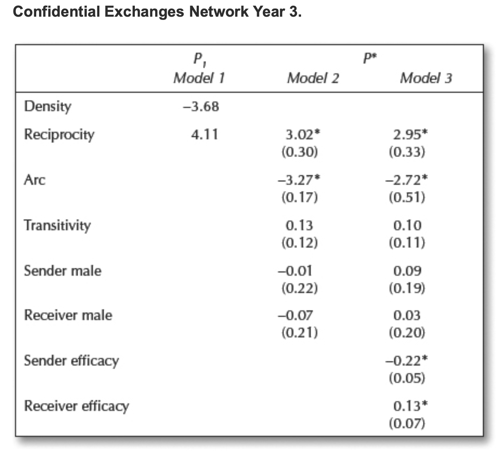

class: clear, title-slide, inverse, center, top, middle

```{r setup, include=FALSE}
knitr::opts_chunk$set(echo = FALSE)
```

```{r, echo=FALSE}
# then load all the relevant packages
pacman::p_load(pacman, 
               knitr, 
               tidyverse, 
               readxl, 
               tidygraph, 
               ggraph,
               statnet,
               ergm)
```

```{r xaringan-panelset, echo=FALSE}
xaringanExtra::use_panelset()
```

```{r xaringanExtra-clipboard, echo=FALSE}
# these allow any code snippets to be copied to the clipboard so they 
# can be pasted easily
htmltools::tagList(
  xaringanExtra::use_clipboard(
    button_text = "<i class=\"fa fa-clipboard\"></i>",
    success_text = "<i class=\"fa fa-check\" style=\"color: #90BE6D\"></i>",
  ),
  rmarkdown::html_dependency_font_awesome()
)
```
```{r xaringan-extras, echo=FALSE}
xaringanExtra::use_tile_view()

```

# `r rmarkdown::metadata$title`
----
### `r rmarkdown::metadata$author`
### `r format(Sys.time(), "%B %d, %Y")`

---
# Agenda

.pull-left[
## Part 1: Core Concepts
### Inference in Networks
- Applications of Inference
- Questions & Models
- A Selection Model Example

]

.pull-right[

## Part 2: R Code-Along
#### Exponential Random Graph Models
- {statnet} Package
- Model Parameters
- Interpreting Outputs
]


???
- In previous labs we focused on ways in which different algorithms can be used to describe properties related to ego or complete networks. 
- In This chapter moves beyond these static snapshots and provides an introduction to the ways in which recent advances in inferential statistics can be used to make predictions from social network data and address the questions in the previous paragraph.
- Part 1 will focus on..
- Part 2 will focus on..   

---
# A Quick Refresher


.pull-left[
## Network Visualization
.center[
```{r, echo=FALSE, warning=FALSE, message=FALSE, out.width = '400px'}
year_1_collaboration <- read_excel("data/year-1-collaboration-ties.xlsx", 
                            col_names = FALSE)

year_3_collaboration <- read_excel("data/year-3-collaboration-ties.xlsx", 
                            col_names = FALSE)

year_1_confidential <- read_excel("data/year-1-confidential-ties.xlsx", 
                            col_names = FALSE)

year_3_confidential <- read_excel("data/year-3-collaboration-ties.xlsx", 
                            col_names = FALSE)

rownames(year_1_collaboration) <- 1:43

colnames(year_1_collaboration) <- 1:43

rownames(year_3_collaboration) <- 1:43

colnames(year_3_collaboration) <- 1:43

rownames(year_1_confidential) <- 1:43

colnames(year_1_confidential) <- 1:43

rownames(year_3_confidential) <- 1:43

colnames(year_3_confidential) <- 1:43

year_1_collab_matrix <- as.matrix(year_1_collaboration)

year_3_collab_matrix <- as.matrix(year_3_collaboration)

year_1_conf_matrix <- as.matrix(year_1_confidential)

year_3_conf_matrix <- as.matrix(year_3_confidential)

year_1_collab_network <- as_tbl_graph(year_1_collab_matrix, directed = TRUE)

year_3_collab_network <- as_tbl_graph(year_3_collab_matrix, directed = TRUE)

year_1_conf_network <- as_tbl_graph(year_1_conf_matrix, directed = TRUE)

year_3_conf_network <- as_tbl_graph(year_3_conf_matrix, directed = TRUE)

leader_nodes <- read_csv("data/school-leader-nodes.csv")

leader_edges <- read_csv("data/school-leader-edges.csv")

leader_graph <- tbl_graph(edges = leader_edges,
                          nodes = leader_nodes,
                          directed = TRUE)


leader_measures <- leader_graph |>
  activate(nodes) |>
  mutate(in_degree = centrality_degree(mode = "in")) |>
  mutate(out_degree = centrality_degree(mode = "out"))

ggraph(leader_measures, layout = 'fr') +
  geom_node_point(aes(size = in_degree)) +
  geom_edge_link() +
  theme_graph()

```
]
]


.pull-right[
## Network Measures

- degree and betweeness **Centrality**

- **Reciprocity** in directed networks

- complete network, group, or neighborhood **Density**
]


???

- Recall that in previous labs we focused on ways in which data visualization and network measurement can be used to describe properties of complete networks, groups within a network, or even individual's place within a network.  
- Network visualizations like this sociogram of school and district leaders, for example, can be a very useful tool for showing what your network looks like and highlighting network properties. For example, just like with this network, sociograms are usually constructed in such a way so that actor that are more central to the network are place in the center of the graph. 
- Network Measures, on the other hand, help to describe mathematically what your network "looks like." 
- For example, measures of centrality can put a number on how much a network as whole centers around a handful of individuals, and which individuals are more central to the network.  
- In directed networks, measures of reciprocity can inform about the flow of information in a network or potential hierarchies in a network.  
- And measures of density, whether for a whole network, group, or even individual actors' "neighborhoods" can can help describe how well connected individuals are in a network. 


---
class: clear, inverse, middle, center

# Part 1: Core Concepts


Inference, Models, and Exemplar 

???

- In Part 1, we move beyond network visualization and measurement and learn how the evolution of statistical inference and models allow social network analysis to not just describe networks and their properties, but attempt to explain and make predictions about them. 
- We'll then take a close look at a study by Alan Daly and colleagues that illustrated how these statistical models for netowrk analysis can be used to gain insight into educational settings. 

---

#  Inference in Networks

.panelset[

.panel[.panel-name[Evolution]

.pull-left[### Aim of Inference
1. Examine "relationships"

1. Test hypotheses

1. Analyze change
]

.pull-right[### Obstacles to Overcome
1. Violation of assumptions

1. Conventional formulas

1. Network dynamism 
]
]

.panel[.panel-name[Permutations]

.pull-left[

- Matrices are rearranged over and over (even thousands of times!)

- Permutations are then compared to your observed data

- If network properties of interest occur often, likely due to chance.

]

.pull-right[
```{r}
year_1_collab_matrix[1:8,1:8]
```
]
]


.panel[.panel-name[Applications]

1. Is there a relationship between the frequency of collaboration between school leaders and their discussion of confidential issues? 
2. Do school leaders prefer to collaborate with those with whom they have collaborated in the past? 
3. Does gender or some other individual attribute predicts confidential exchanges between school leaders, or does some previous relation have a stronger effect? 
4. Does collaboration between leaders explain one's level of trust in colleagues? 
5. Can we distinguish among different groups of school leaders based on how frequently they collaborate, and if so, are these groupings related to the level at which they work (school versus district)?

]

.panel[.panel-name[Discussion]

Think about a network you are a part of or may be interested in studying. What research question(s) might you ask about the following relationship between:  
- different types of ties
- actor attributes and ties
- network properties and actor attributes
- groups in the network

Record your response in the chat. 

]

]

???
## Evolution
### Aims of Inference
- note 
### Obstacles to Overcome
- note
## Permutations
- note


---
# Models in Networks

.panelset[


.panel[.panel-name[QAP]

.pull-left[
```{r y1-collaboration, echo=FALSE, message=FALSE, warning=FALSE, out.width = '350px'}
ggraph(year_1_collab_network) +
  geom_node_point(size = 3) +
  geom_edge_link() +
  theme_graph() +
  ggtitle("Year 1 Collaboration Ties")
```
]


.pull-right[
```{r y3-confidential, echo=FALSE, message=FALSE, warning=FALSE, out.width = '350px'}
ggraph(year_1_conf_network) +
  geom_node_point(size = 3) +
  geom_edge_link() +
  theme_graph() +
  ggtitle("Year 3 Confidential Ties")
```


]
]

.panel[.panel-name[MR-QAP]

.pull-left[
*Do school leaders prefer to collaborate with those with whom they have collaborated in the past or with those that they have discussed confidential issues?*
]

.pull-right[
.center[]
]
]


.panel[.panel-name[P1 & P-Star]


.pull-left[

*Does gender or some other individual attribute predicts confidential exchanges between school leaders, or does some previous relation have a stronger effect?*

]


.pull-right[
.center[]

]

]

.panel[.panel-name[Regression]


.pull-left-narrow[

*Does collaboration between leaders explain one's level of trust in colleagues?*

]


.pull-right-wide[
```{r, message=FALSE}
leader_nodes <- read_csv("data/school-leader-nodes.csv")

leader_edges <- read_csv("data/school-leader-edges.csv")

leader_graph <- tbl_graph(edges = leader_edges,
                          nodes = leader_nodes,
                          directed = TRUE)


leader_measures <- leader_graph |>
  activate(nodes) |>
  mutate(in_degree = centrality_degree(mode = "in")) |>
  mutate(out_degree = centrality_degree(mode = "out"))

node_measures <- leader_measures |> 
  activate(nodes) |>
  as_tibble()

head(node_measures)
```

]

]

.panel[.panel-name[Discuss]

Think about a network you are a part of or may be interested in studying. What research question(s) might you ask about the following relationship between:  
- different types of ties
- actor attributes and ties
- network properties and actor attributes
- groups in the network

Record your response in the chat. 
]

]

???
## QAP
- The quadratic assignment procedure developed by Hubert (1987) and Krackhardt (1987b) tests the null hypothesis of no correlation between the two networks and adjusts for this dependence between networks by repeatedly permuting the order of rows and columns of one of the networks while keeping the other network intact.
- It is useful, for example, in determining whether there is a relationship between collaboration among school leaders in year 1 and how often they engage in confidential exchanges in year 3. Or you could examine the relationship between how frequently school leaders turn to each other to discuss issues of a confidential nature in year 1 and collaboration in year 3.
- 


---
# A Research Exemplar

.panelset[

.panel[.panel-name[Context]

.pull-left[

This longitudinal case study **examines reform-related knowledge, advice, and innovation network structures** among administrators in a district under sanction for under-performance and engaging in district-wide reform efforts.
]

.pull-right[

.center[]
]

]

.panel[.panel-name[Questions]

This study involves **quantifying and visualizing the ties and overall structure** of informal networks to answer the following research questions: 

1. In what ways have reform-related social networks between district and site leaders evolved **over a 2-year period**? 
2. How do district and school leaders perceive the evolution of the social networks and its **effect on the exchange of reform-related resources** within the district?
]

.panel[.panel-name[Data]
To answer RQ1, Daly and Finnigan administered **online survey consisting of network relations and demographic questions** asking participants to:
- select the administrators in the La Estasis network that they interact with for the purpose of **advise seeking, collaboration, confidential exchanges**,
- assess their relationships on a **5-point interaction scale** ranging from 1 (no interaction) to 5 (1 to 2 times a week).

]


.panel[.panel-name[Analysis]

.pull-left[
### QAP
- We conducted a series of QAP correlations using UCINET software
]

.pull-right[

.center[]
]

]


.panel[.panel-name[Key Findings]

Overall, the findings from SNA and qualitative interviews indicate that over time: 
- Networks **increased the number of superficial interactions**.
- More frequent exchanges, however, remained unchanged. 
- The result was a centralized network structure.
]

]


.footnote[
Daly, A. et al. (2011). [The ebb and flow of social network ties between district leaders.](https://github.com/laser-institute/network-analysis/blob/main/lab-4/lit/daly-ebb-flow.pdf)
]

???

---
class: clear, inverse, middle, center

# part_2(R, code_along)

Network Packages, Objects, and Sociograms


---
# Prepare

.panelset[

.panel[.panel-name[Research Question]

*Does gender or some other individual attribute predict confidential exchanges between school leaders?*

]

.panel[.panel-name[Load Libraries]

Let's start by creating a new R script and loading the following packages introduced in the previous lab:          

```{r load-libraries, message=TRUE, echo=TRUE, message=FALSE}
library(readxl)
library(tidyverse)
library(tidygraph)
library(ggraph)
library(janitor)
```


]

.panel[.panel-name[ergm 📦]

The {ergm}  package and its collection of network analysis tools provide:

- pain-free implementation of graph algorithms
- fast handling of large graphs, with millions of vertices and edges

Both {tidygraph} and {ggraph} used in the previous lab depend heavily on the {igraph} package. 

]


.panel[.panel-name[Your Turn]

Load the {ergm} package.

```{r, echo=FALSE, message=FALSE}
library(ergm)
library(statnet)
```

```{r load-igraph, echo=TRUE}
# YOUR CODE HERE


```

]

]

---

# Import Data   

.panelset[

.panel[.panel-name[Import Data]

Let's import two Excel files from the Social Network Analysis and Education companion site. year_1_collaboration.xlsx 

```{r import-data, echo=TRUE, message=FALSE}
leader_nodes <- read_csv("data/school-leader-nodes.csv")

leader_edges <- read_csv("data/school-leader-edges.csv")
```


]

.panel[.panel-name[Inspect Data]

In the corresponding line of your R script, take a look at the node and edge lists we just imported:

```{r inspect-data, echo=TRUE}
# ADD CODE BELOW
#
#

```


]

.panel[.panel-name[Discuss]

Think about the questions below and be prepared to share your response:              
1. What do you think the values for each tie represent?
1. What do you think the "trust" and "efficacy" variables represent?
1. What else do you notice about this data? 
1. What else do you wonder about this data?

Hint: Take a look at the SNA in Ed [companion site](https://studysites-sagepub-com.prox.lib.ncsu.edu/carolan/study/resources.htm) 

Type your response to one of these questions in the chat. 

]

.panel[.panel-name[Answer]

- Edge values indicate the frequency of interactions leaders have with nominated individuals on a four-point frequency scale ranging from 1 (the least frequent) to 4 (1–2 times a week). 
- `efficacy` measures a belief in their ability to have an effect derived from a scale that includes 18 items rated on a 9-point Likert scale ranging from 1 (None at all) to 9 (A great deal). 
- `trust` measures perceptions of the level of trust their school and district is a composite score based on scale contains eight items rated on a 7-point Likert scale ranging from 1 (Strongly disagree) to 7 (Strongly agree). 
]
]

---
# Wrangle  

.panelset[


.panel[.panel-name[as.network() function]

The {ergm} package requires an object of the class "network" — the format that {statnet} uses to store and work with network data.

The `as.network()` function does just that and takes the following arguments:

`x` = a matrix giving the network structure in adjacency, incidence, or edgelist form;

`vertices =` an optional data.frame containing the vertex attributes. The first column is assigned to the "vertex.names" and additional columns are used to set vertex attributes using their column names.

Run the following code in your consul to pull up the help page for teh :

```{r as.network, echo=TRUE, message=FALSE, warning=FALSE, eval=FALSE}
?as.network
```


]

.panel[.panel-name[Convert to Network]

Before we can begin analyzing our network data in R, we need to convert to a network class R object. Run the following code in your R script:

```{r dichotomize-matrix, echo=TRUE, message=FALSE, warning=FALSE}
leader_network <- as.network(leader_edges,
                             vertices = leader_nodes)

leader_network

```


]

.panel[.panel-name[Check Class]

Before we can begin analyzing our network data in R, we need to convert to a network class R object. Run the following code in your R script:

```{r add-names, echo=TRUE, message=FALSE, warning=FALSE}

class(leader_network)
```
]

.panel[.panel-name[View Network]

In the corresponding line of your R script, type the name of network object we just created and run the code:

```{r view-netwok, echo=TRUE}
# ADD CODE BELOW
#
#

```


]


]

---
# Model

.panelset[


.panel[.panel-name[Model Specification]

The syntax for specifying a model in the `ergm` package follows **R**'s
formula convention:
`my_network ~ ergm_term_1 + ergm_term_2 + ergm_term_3` and so forth.

In the Help tab, search for "ergm-terms" and select the `ergm::ergm-terms` help page to take a quick peek at the plethora of parameters you can include in your model. 

]

.panel[.panel-name[ERGM 1]

Let's start with with a simple model that contains the following ergm-terms 
- **`edges`** a required term that represents the total number of edges in the network, and the ergm-term
- **`mutual`** examines the tendency for ties to be reciprocated,
i.e. "mutuality".

```{r ERGM-1, echo=TRUE, message=FALSE, warning=FALSE}

# ensure reproducibility of our model
set.seed(589) 

# fit our ergm model 
ergm_mod_1 <-ergm(leader_network ~ edges + mutual) 

# get summary statistics for our model
summary(ergm_mod_1) 

```


]

.panel[.panel-name[ERGM 2]

Let's now test for homophily -- or the "birds of a feather" phenomenon -- in our network. The `ergm()` function now includes a `nodematch()` term to answer the following question:

*Are school leaders more likely to confide in colleagues of their own gender or who work at the same site level (e.g., school vs. central office)?*

```{r ERGM-2, echo=TRUE, message=FALSE, warning=FALSE}

# fit our ergm model 
ergm_mod_2 <-ergm(leader_network ~ edges + mutual + nodematch('male') + nodematch('district_site')) 

# get summary statistics for our model
summary(ergm_mod_2) 

```
]

.panel[.panel-name[ERGM 3]

Let's now test for homophily -- or the "birds of a feather" phenomenon -- in our network. The `ergm()` function now includes a `nodematch()` term to answer the following question:

*Are school leaders with higher levels of trust more likely to have confidential exchanges?*

```{r ERGM-3, echo=TRUE, message=FALSE, warning=FALSE}

# fit our ergm model 
ergm_mod_3 <-ergm(leader_network ~ edges + mutual + nodematch('male') + nodematch('district_site') + nodecov('trust')) 

# get summary statistics for our model
summary(ergm_mod_3) 

```
]
]


---
# What's Next

.pull-left[
## Essential Readings

- Reading 1: [Statistical Inference With Network Data](https://via.hypothes.is/https://drive.google.com/file/d/1-zf90wAZGm2uM7qX-2HoeWTLmxn2ndJz/view?usp=sharing)

- Reading 2: [Network Data and Statistical Models](https://via.hypothes.is/https://drive.google.com/file/d/104zBHOcZL0Nj1Snm2KR1QAKOk96dtZfH/view?usp=sharing)  

] 

.pull-right[
## Case Study

- SNA Case Study: [Birds of a Feather Lead Together](https://laser-institute.github.io/network-analysis/lab-4/sna-lab-4-case-key.html)

- Guiding Study: [The ebb and flow of social network ties between district leaders.](https://github.com/laser-institute/network-analysis/blob/main/lab-4/lit/daly-ebb-flow.pdf)

]


---
class: clear, center

## .font130[.center[**Thank you!**]]
<br/>
.center[<br/>**Dr. Shaun Kellogg**<br/><mailto:sbkellog@ncsu.edu>]
