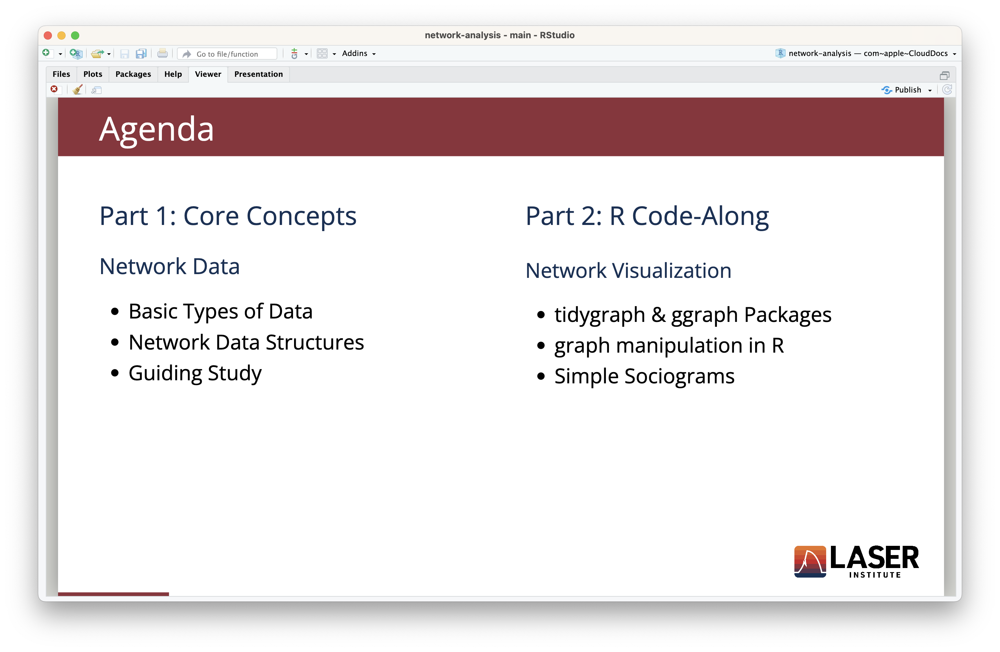
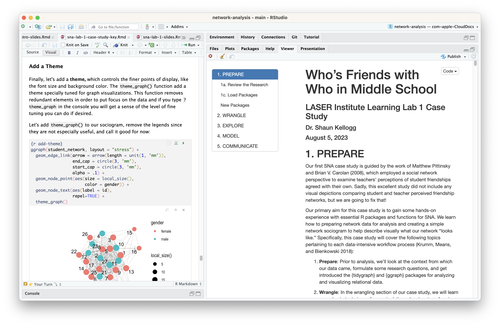
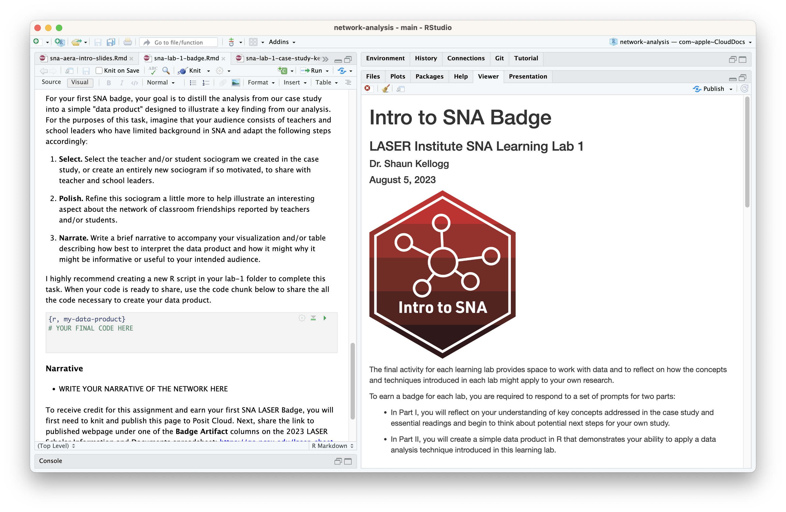

class: clear, title-slide, inverse, center, top, middle

# `r rmarkdown::metadata$title`
## `r rmarkdown::metadata$subtitle`
### `r rmarkdown::metadata$author`
### `r format(Sys.time(), "%B %d, %Y")`

```{r xaringan-panelset, echo=FALSE}
xaringanExtra::use_panelset()
```

---
# Agenda

- **1:00 - 1:50 Introduction**
  - Introduction to SNA & Bingo (Sasha)
  - Overview of SNA LASER Learning Labs (Shaun)
- **1:50 - 2:00 Break** 
- **2:00 - 3:00 Lab 1: SNA for Newbies** 
  - Conceptual Overview (Bodong)
  - Code-Along (Jeanne)
- **3:00 - 3:30 Break** 
  - Optional Case-Study Orientation (Shaun & Jeanne) 
- **4:00 - 5:00 (Lab 2: Management & Measurement)** 
  - Conceptual Overview (Shaun) 
  - Code-Along (Jeanne) 
- **5:00 - 5:30 Afterparty!** 


???

---
class: clear, laser

.quote["From its earliest origins to it most recent applications to large-scale networks, social network analysis has reflected an **interdependency between theory and method.**"]

.author[~ Brian Carolan]


---
class: clear, inverse, center, middle

# Part 1: Intro to SNA
----

Hallmarks, Applications, and Discussion

---
# The Four Hallmarks of SNA

.panelset[

.panel[.panel-name[Relationships]
Social network analysis is based on **ties** connecting social **actors** and is motivated by our intuition that relationships between individuals matter:

- no individual is an island, independence is NOT assumed
- who we know, are friends with, or talk with matters
- the influence of these relations is shaped by the larger network
- location in a social structure shapes one's opportunities and outcomes

<br>
.font80[[Freeman, L. (2004). The development of social network analysis.](https://www.researchgate.net/publication/239228599_The_Development_of_Social_Network_Analysis)]
]

.panel[.panel-name[Empirical Data]
It is firmly grounded in **systematic empirical data collection** using methods refined over decades and methods still evolving:

- observations of social context
- surveys and questionnaires 
- historical and administrative records
- digital learning tools and social media 

]

.panel[.panel-name[Graphical Imagery]

.pull-left[
It makes use of **graphic imagery** to represent actors and their relations with one another.

- Shapes for actors (nodes, vertices)
- Lines for relations (ties, edges)
]

.pull-right[.center[
.font80[Fourth Grade Friendship Choices

<br/> 
Jacob Moreno & Helen Jenning (1934)]
]
]

]

.panel[.panel-name[Mathmatically Based]
It relies on the use of **mathematical and/or computational models** to succinctly represent the complexity of social life:
.pull-left[
### Network Stats (Describe)
- Centrality
- Reciprocity
- Density

]

.pull-right[
### Inferential Models (Predict)
- CONCOR
- QAP
- ERGMS
]
]


]

---
# Applications of SNA

.panelset[

.panel[.panel-name[Overview]
Interest in SNA as an alternative method for studying educational phenomena such has grown tremendously in the past few decades:

- Diffusion and adoption of innovations 
- Social influence 
- Belief systems 
- Social capital 
- Homophily 
- Efficacy of interventions 
- Small-group dynamics

]

.panel[.panel-name[Social Capital]
SNA provides a means to actually measure & model social capital and has be used to better understand:

- how social relations advantages some students (Maroulis and Gomez, 2008)
- dropout among Latino/a/ex students (Ream and Rumberger, 2008) 
- school-oriented friendship networks have the potential to reduce dropout rates
- parental social closure and student math achievement (Morgan and Todd, 2008)
]

.panel[.panel-name[Selection & Influence]
Educational researchers have used modeling of peer selection and influence to better understand: 

- who school leaders collaborate and confide in and why (Daly and Finnigan, 2010)
- how the characteristics of friends shape students’ aspirations and college attendance (Hallinan & Williams, 1990) 
- teachers’ attitudes toward school and district reforms (Cole & Weinbaum, 2010)


]

.panel[.panel-name[Diffusion]
Building on theories of diffusion, SNA has been used to explain how ideas and resources spread within and between networks of actors, such as: 

- attitudes and use of computers in classrooms over time (Frank et al., 2011)
- how substance abuse diffuses across adolescent networks (Valente et al., 2004)
- diffusion of charter school policy and creation across states (Renzulli and Roscigno, 2005)
]


]

---
# Discussion
Consider a social network of which you are a part. 
1. Who are the members or "actors" in this network? 

1. What relationships or "ties" connect these actors? 

1. Are there any groups or "cliques" within this network?  

1. Are there any actors that "central" to this network? 

---
class: clear, inverse, center, middle

# Part 2: SNA Learning Labs
----

Activities, Topics, and Tools


---
class: no-logo
# Learning Lab Components

.panelset[

.panel[.panel-name[Presentation]

.center[]

]

.panel[.panel-name[Case Study]

.center[]
]


.panel[.panel-name[Essential Readings]
.pull-left[
.center[]
]

.pull-right[
.center[]
]


]

.panel[.panel-name[LASER Badge]

.center[]

]

]

---
class: no-logo

# The LASER Learning Lab Toolkit

.panelset[

.panel[.panel-name[Posit Cloud]

.center[

<br/>
[go.ncsu.edu/sna-labs](https://go.ncsu.edu/sna-labs)
]

]

.panel[.panel-name[RStudio]
.center[

]
]

.panel[.panel-name[R Markdown]
.center[

]
]


.panel[.panel-name[GitHub]

.center[

<br/>
[go.ncsu.edu/laser-github](https://go.ncsu.edu/laser-github)
]

]


]

???

## Tool Types
N/A

## Posit Cloud
Posit Cloud (formerly RStudio Cloud) provides a powerful set of data science tools right in your browser with no installation or complex configuration required. 

All of our Learning Lab materials will be access through Posit Cloud this year so we encourage you bookmark posit.cloud in your browser. 

< Have scholars navigate to our LASER Learning Labs 2023 workspace using the link provide and provide a breif overview of the the Posit Cloud features like workspaces, primers, cheatsheets, etc. > 

## RStudio
< Next have scholars navigate to our laser-orientation RStudio Project "assignment" and click the link to make a copy for themselves and open up the project. > 

RStudio is an integrated development environment (IDE) for R and Python and includes a console for running R code directly, syntax-highlighting editor that supports direct code execution in the source pane, and tools for plotting, history, debugging, and management of research projects in the Environment and Files panes. RStudio is basically your home for all of the files, images, reports, and code that are used in a research project given project.

When you create a "project" with RStudio, it's straightforward to divide your work into multiple contexts, each with their own working directory, workspace, history, and source documents.

< Provide a brief walkthrough of the different panes and discuss what they are used for including how they might make their own R Project is they so desired. >

## R Markdown
< Show scholars how to navigate to the files tab and open up the file named laser-lab-slides.Rmd>

As we noted earlier, plain text files written in markup languages like Markdown can be the basis for documents such as presentations, webpages, dashboards, and books. 

This R Markdown file can be opened not just with RStudio, but a simple text editor built into most operating systems. This specific text file is what was used to make the slides you're looking at now. 

Click the "knit" button located at the top of the toolbar to convert this markdown file into an HTML slide show. I should appear in the Viewer table or in a separate browser window and you will need it for our Part 2 code along. 

## GitHub
GitHub is an interface and cloud hosting service built on top of the Git version control system. GitHub was not explicitly designed to host research projects or even data, but for programmers to work together to build computer programs. This seems very far from reproducible research but remember that as reproducible researchers, we are building projects out of interconnected text fles. In important ways, this is exactly the same as building a computer program and offers many highly developed and robust features for reproducible researchers.

We won't be using GitHub in our Learning Labs, but I did want to note that if you click the link below, it will take you to our GitHub organization site where you will find our RStudio Projects stored as Repositories, or repos, including the laser-orientation repository you just opened. 

## R 
Underlying all of this is R, a programming language originally for statistics and graphics but has evolved into rich platform for data science and learning analytics that can be used to create a wide range of static and dynamic outputs for communicating your research.

Let's create a new R script so we can begin working with R to help illustrate a simple research workflow and analyze some data. 

< Direct scholars to create a new R script as illustrated in the screenshot. Show them how to name the file and save to their main directory. > 

---

# SNA Lab 1: Network Analysis for Newbies


.pull-left[
### Intro Presentation 
[Key Concepts & Code-Along](https://laser-institute.github.io/network-analysis/lab-1/sna-lab-1-slides.html)


### Essential Readings

- [The Social Network Perspective](https://github.com/laser-institute/essential-readings/blob/main/sna-labs/sna-lab-1/carolan-network-perspective.pdf)

- [Historical, Theoretical, and Analytical Foundations](https://github.com/laser-institute/essential-readings/blob/main/sna-labs/sna-lab-1/carolan-history-theory.pdf)  

- [Basic Concepts](https://github.com/laser-institute/essential-readings/blob/main/sna-labs/sna-lab-1/carolan-basic-concepts.pdf)  

] 

.pull-right[
### Learning Lab 1 Badge
- [Intro to SNA](https://laser-institute.github.io/network-analysis/lab-1/sna-lab-1-badge.html)


### Case Study

- [SNA Case Study: Who's Friends with Who in Middle School?](https://laser-institute.github.io/network-analysis/lab-1/sna-lab-1-case-study-key.html)

- [Guiding Study: Behavioral versus cognitive classroom friendship networks.](https://github.com/laser-institute/essential-readings/blob/main/sna-labs/sna-lab-1/pittinsky-class-friendships.pdf)

]

---
# SNA Lab 2: Data Management & Measurement


.pull-left[
### Intro Presentation 
[Key Concepts & Code-Along](https://laser-institute.github.io/network-analysis/lab-2/sna-lab-2-slides.html)

### Essential Readings

- [Collecting and Managing Network Data](https://github.com/laser-institute/essential-readings/blob/main/sna-labs/sna-lab-2/sna-chapter-4.pdf)

- [Structural Measures for Complete Networks](https://github.com/laser-institute/essential-readings/blob/main/sna-labs/sna-lab-2/sna-chapter-5.pdf)  
]

.pull-right[
### Learning Lab 2 Badge
- [Network Measurement](https://laser-institute.github.io/network-analysis/lab-2/sna-lab-2-badge.html)

### Case Study

- [SNA Case Study: A Tale of Two MOOCs](https://laser-institute.github.io/network-analysis/lab-2/sna-lab-2-case-study-key.html)

- [Guiding Study: Massively Open Online Course for Educators (MOOC-Ed) network dataset](https://bera-journals.onlinelibrary.wiley.com/doi/abs/10.1111/bjet.12312)

]

---
# SNA Lab 3: Group & Egocentric Analysis


.pull-left[
### Intro Presentation 
[Key Concepts & Code-Along](https://laser-institute.github.io/network-analysis/lab-3/sna-lab-3-slides.html)

### Essential Readings

- [Groups and Positions in Complete Networks](https://github.com/laser-institute/essential-readings/blob/main/sna-labs/sna-lab-4/carolan-sna-ch-6.pdf)

- [Measures for Egocentric Network Analysis](https://github.com/laser-institute/essential-readings/blob/main/sna-labs/sna-lab-4/carolan-sna-ch-7.pdf)  
] 

.pull-right[
### Learning Lab 3 Badge
- [Groups & Egos](https://laser-institute.github.io/network-analysis/lab-3/sna-lab-3-badge.html)

### Case Study

- [SNA Case Study: Components, Cliques, & Key Actors](https://laser-institute.github.io/network-analysis/lab-3/sna-lab-3-case-study-key.html)

- [Guiding Study: Hashtag Common Core](https://www.hashtagcommoncore.com)
]


---
# SNA Lab 4: Inference & Modeling 


.pull-left[
### Intro Presentation 
[Key Concepts & Code-Along](https://laser-institute.github.io/network-analysis/lab-4/sna-lab-4-slides.html)

### Essential Readings

- [Statistical Inference With Network Data](https://github.com/laser-institute/essential-readings/blob/main/sna-labs/sna-lab-4/carolan-sna-ch-8.pdf)

- [Network Data and Statistical Models](https://github.com/laser-institute/essential-readings/blob/main/sna-labs/sna-lab-4/carolan-sna-ch-9.pdf)  
] 

.pull-right[
### Learning Lab 4 Badge
- [Models & Inference](https://laser-institute.github.io/network-analysis/lab-4/sna-lab-4-badge.html)

### Case Study

- [SNA Case Study: Birds of a Feather Lead Together](https://laser-institute.github.io/network-analysis/lab-4/sna-lab-4-case-key.html)

- [Guiding Study: The ebb and flow of social network ties between district leaders.](https://github.com/laser-institute/essential-readings/blob/main/sna-labs/sna-lab-4/daly-ebb-flow.pdf)
]

---
class: clear, center

## .font130[.center[**Thank you!**]]


.center[<br/>**Shaun Kellogg**<br/><mailto:sbkellog@ncsu.edu>]

.pull-left-narrow[.center[ ]]

.pull-right-wide[
.left[.font70[

This work was supported by the National Science Foundation grant DRL-2025090 (ECR:BCSER). Any opinions, findings, and conclusions expressed in this material are those of the authors and do not necessarily reflect the views of the National Science Foundation.
]]]


