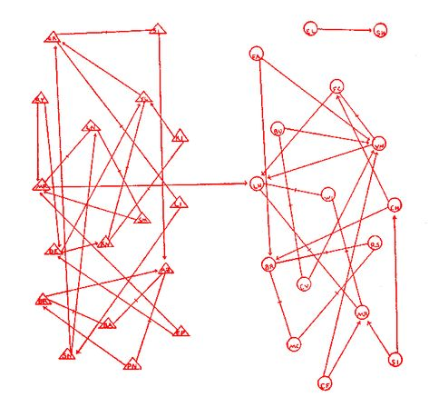

class: clear, title-slide, inverse, center, top, middle

# `r rmarkdown::metadata$title`
## `r rmarkdown::metadata$subtitle`
### `r rmarkdown::metadata$author`
### `r format(Sys.time(), "%B %d, %Y")`

```{r xaringan-panelset, echo=FALSE}
xaringanExtra::use_panelset()
```

---
# Agenda

.pull-left[
## Part 1: Intro to SNA
- The Four Hallmarks of SNA
- Applications of SNA
- Discussion

]

.pull-right[

## Part 2: LASER Learning Labs
- Intro to SNA
- Network Measurement
- Groups & Egos
- Statistical Inference & Models
]


???

---
class: clear, laser

.quote["From its earliest origins to it most recent applications to large-scale networks, social network analysis has reflected an **interdependency between theory and method.**"]

.author[~ Brian Carolan]


---
class: clear, inverse, center, middle

# Part 1: Intro to SNA
----

Hallmarks, Applications, and Discussion

---
# The Four Hallmarks of SNA

.panelset[

.panel[.panel-name[Relationships]
Social network analysis is motivated by a **relational** intuition based on ties connecting social actors:

- no individual is an island, do NOT assume independence
- who we know, are friends with, or talks with matters
- the influence of these relations is shaped by the larger network
- location in a social structure shapes one's opportunities and outcomes

<br>
.font80[[Freeman, L. (2004). The development of social network analysis.](https://www.researchgate.net/publication/239228599_The_Development_of_Social_Network_Analysis)]
]

.panel[.panel-name[Empirical Data]
It is firmly grounded in **systematic empirical data collection** using methods refined over decades and methods still evolving:

- observations of social context
- surveys and questionnaires 
- historical and administrative records
- digital learning tools and social media 

]

.panel[.panel-name[Graphical Imagery]

.pull-left[
It makes use of **graphic imagery** to represent actors and their relations with one another.

- Shapes for actors (nodes, vertices)
- Lines for relations (ties, edges)
]

.pull-right[.center[


.font80[.center[Moreno's 1930s elementary friendship network.]]
]
]Jacob Moreno 1930s friendship networks among elementary school students. 

]

.panel[.panel-name[Mathmatically Based]
It relies on the use of **mathematical and/or computational models** to succinctly represent the complexity of social life:
.pull-left[
### Network Stats (Describe)
- Centrality
- Reciprocity
- Density

]

.pull-right[
### Inferential Models (Predict)
- CONCOR
- QAP
- ERGMS
]
]


]

---
# Applications of SNA

.panelset[

.panel[.panel-name[Overview]
Interest in SNA as an alternative method for studying educational phenomena such has grown tremendously in the past few decades:

- Diffusion and adoption of innovations (Daly & Finnigan, 2010) 
- Social influence (Cole & Weinbaum, 2010) 
- Belief systems (Frank, Kim, & Belman, 2010) 
- Social capital (Maroulis & Gomez, 2008) 
- Homophily (Coburn, Choi, & Mata, 2010) 
- Efficacy of interventions (Valente et al., 2003) 
- Small-group dynamics (Katz et al., 2004) 

]

.panel[.panel-name[Social Capital]
SNA provides a means to actually measure & model social capital and has be used to better understand:

- how social relations advantages some students (Maroulis and Gomez, 2008)
- dropout among Latino/a/ex students (Ream and Rumberger, 2008) 
- school-oriented friendship networks have the potential to reduce dropout rates
- parental social closure and student math achievement (Morgan and Todd, 2008)
]

.panel[.panel-name[Selection & Influence]
Educational researchers have used modeling of peer selection and influence to better understand: 

- who school leaders collaborate and confide in and why (Daly and Finnigan, 2010)
- how the characteristics of friends shape students’ aspirations and college attendance (Hallinan & Williams, 1990) 
- teachers’ attitudes toward school and district reforms (Cole & Weinbaum, 2010)


]

.panel[.panel-name[Diffusion]
Building on theories of diffusion, SNA has been used to explain how ideas and resources spread within and between networks of actors, such as: 

- attitudes and use of computers in classrooms over time (Frank et al., 2011)
- how substance abuse diffuses across adolescent networks (Valente et al., 2004)
- diffusion of charter school policy and creation across states (Renzulli and Roscigno, 2005)
]


]

---
# Discussion
Consider a social network of which you are a part. 
1. Who are the members or "actors" in this network? 

1. What relationships or "ties" connect these actors? 

1. Are there any groups or "cliques" within this network?  

1. Are there any actors that "central" to this network? 

---
class: clear, inverse, center, middle

# Part 2: SNA Learning Labs
----

Basic Concepts, Measurement, Groups, and Model

---
# SNA Lab 1: Network Analysis for Newbies


.pull-left[
### Intro Presentation 
[Key Concepts & Code-Along](https://laser-institute.github.io/network-analysis/lab-1/sna-lab-1-slides.html)


### Essential Readings

- [The Social Network Perspective](https://github.com/laser-institute/essential-readings/blob/main/sna-labs/sna-lab-1/carolan-network-perspective.pdf)

- [Historical, Theoretical, and Analytical Foundations](https://github.com/laser-institute/essential-readings/blob/main/sna-labs/sna-lab-1/carolan-history-theory.pdf)  

- [Basic Concepts](https://github.com/laser-institute/essential-readings/blob/main/sna-labs/sna-lab-1/carolan-basic-concepts.pdf)  

] 

.pull-right[
### Learning Lab 1 Badge
- [Intro to SNA](https://laser-institute.github.io/network-analysis/lab-1/sna-lab-1-badge.html)


### Case Study

- [SNA Case Study: Who's Friends with Who in Middle School?](https://laser-institute.github.io/network-analysis/lab-1/sna-lab-1-case-study-key.html)

- [Guiding Study: Behavioral versus cognitive classroom friendship networks.](https://github.com/laser-institute/essential-readings/blob/main/sna-labs/sna-lab-1/pittinsky-class-friendships.pdf)

]

---
# SNA Lab 2: Data Management & Measurement


.pull-left[
### Intro Presentation 
[Key Concepts & Code-Along](https://laser-institute.github.io/network-analysis/lab-2/sna-lab-2-slides.html)

### Essential Readings

- [Collecting and Managing Network Data](https://github.com/laser-institute/essential-readings/blob/main/sna-labs/sna-lab-2/sna-chapter-4.pdf)

- [Structural Measures for Complete Networks](https://github.com/laser-institute/essential-readings/blob/main/sna-labs/sna-lab-2/sna-chapter-5.pdf)  
]

.pull-right[
### Learning Lab 2 Badge
- [Network Measurement](https://laser-institute.github.io/network-analysis/lab-2/sna-lab-2-badge.html)

### Case Study

- [SNA Case Study: A Tale of Two MOOCs](https://laser-institute.github.io/network-analysis/lab-2/sna-lab-2-case-study-key.html)

- [Guiding Study: Massively Open Online Course for Educators (MOOC-Ed) network dataset](https://bera-journals.onlinelibrary.wiley.com/doi/abs/10.1111/bjet.12312)

]

---
# SNA Lab 3: Group & Egocentric Analysis


.pull-left[
### Intro Presentation 
[Key Concepts & Code-Along](https://laser-institute.github.io/network-analysis/lab-3/sna-lab-3-slides.html)

### Essential Readings

- [Groups and Positions in Complete Networks](https://github.com/laser-institute/essential-readings/blob/main/sna-labs/sna-lab-4/carolan-sna-ch-6.pdf)

- [Measures for Egocentric Network Analysis](https://github.com/laser-institute/essential-readings/blob/main/sna-labs/sna-lab-4/carolan-sna-ch-7.pdf)  
] 

.pull-right[
### Learning Lab 3 Badge
- [Groups & Egos](https://laser-institute.github.io/network-analysis/lab-3/sna-lab-3-badge.html)

### Case Study

- [SNA Case Study: Components, Cliques, & Key Actors](https://laser-institute.github.io/network-analysis/lab-3/sna-lab-3-case-study-key.html)

- [Guiding Study: Hashtag Common Core](https://www.hashtagcommoncore.com)
]


---
# SNA Lab 4: Inference & Modeling 


.pull-left[
### Intro Presentation 
[Key Concepts & Code-Along](https://laser-institute.github.io/network-analysis/lab-4/sna-lab-4-slides.html)

### Essential Readings

- [Statistical Inference With Network Data](https://github.com/laser-institute/essential-readings/blob/main/sna-labs/sna-lab-4/carolan-sna-ch-8.pdf)

- [Network Data and Statistical Models](https://github.com/laser-institute/essential-readings/blob/main/sna-labs/sna-lab-4/carolan-sna-ch-9.pdf)  
] 

.pull-right[
### Learning Lab 4 Badge
- [Models & Inference](https://laser-institute.github.io/network-analysis/lab-4/sna-lab-4-badge.html)

### Case Study

- [SNA Case Study: Birds of a Feather Lead Together](https://laser-institute.github.io/network-analysis/lab-4/sna-lab-4-case-key.html)

- [Guiding Study: The ebb and flow of social network ties between district leaders.](https://github.com/laser-institute/essential-readings/blob/main/sna-labs/sna-lab-4/daly-ebb-flow.pdf)
]

---
class: clear, center

## .font130[.center[**Thank you!**]]


.center[<br/>**Shaun Kellogg**<br/><mailto:sbkellog@ncsu.edu>]

.pull-left-narrow[.center[ ]]

.pull-right-wide[
.left[.font70[

This work was supported by the National Science Foundation grant DRL-2025090 (ECR:BCSER). Any opinions, findings, and conclusions expressed in this material are those of the authors and do not necessarily reflect the views of the National Science Foundation.
]]]


